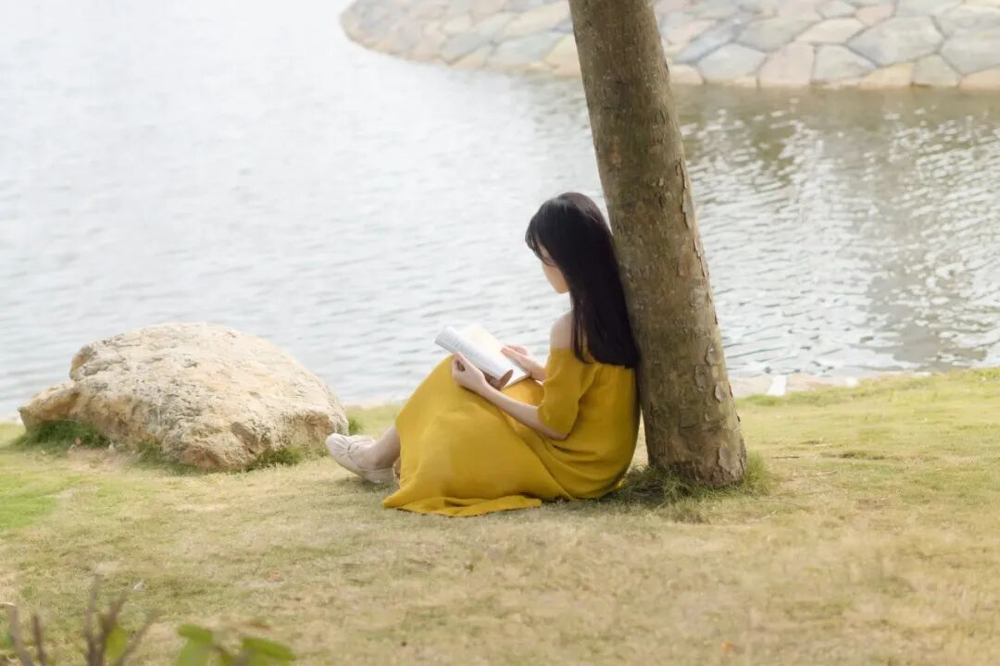
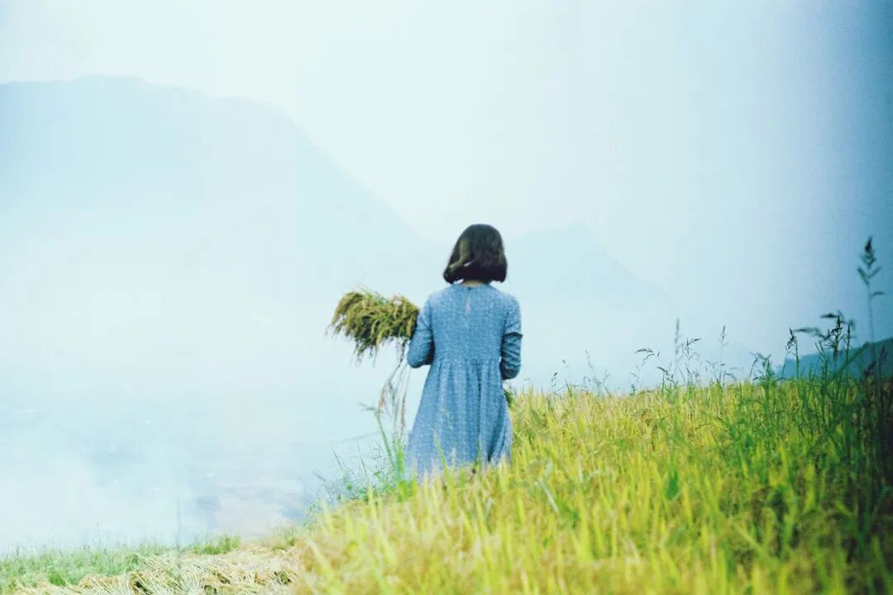
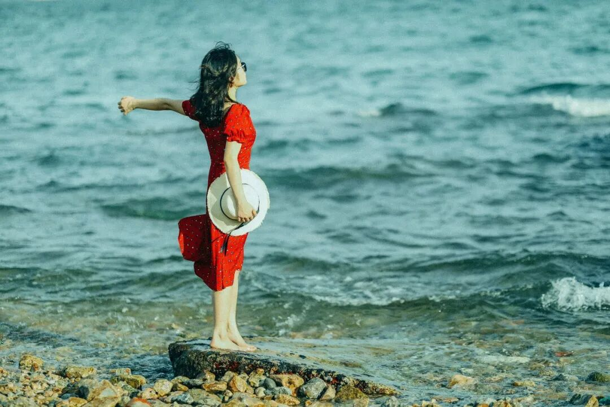
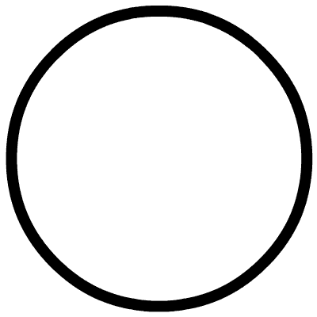
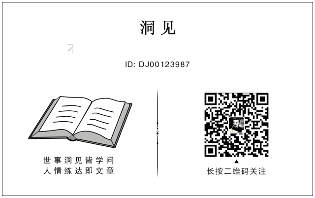
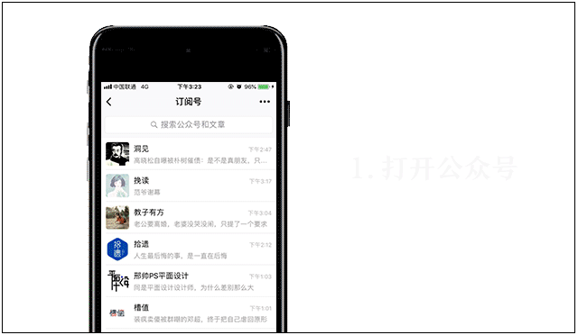

# 最好的养生，都是免费的

**作者**: 洞见
**原文链接**: https://mp.weixin.qq.com/s/vguVr0tLlMleZY-ltGPZZg
**抓取时间**: 2026-05-27 23:37:17

---
 洞见 （DJ00123987） ——不一样的观点，不一样的故事，3000万人订阅的微信大号。点击标题下蓝字“洞见”关注，我们将为您提供有价值、有意思的延伸阅读。  作者：人亿 来源：读者 （ID: duzheweixin） 不以物喜，不以己悲。 ♬ 点上方播放按钮可收听 洞见主播韩丹朗读音频  
 生物学博士尹烨曾在一次演讲中说：“真正养生的方法，其实都不花钱。” 
 生活中，很多人为了追求健康养生，学过各种各样的保养方法，也买过形形色色的保健产品。 
 可结果往往是投入了不少时间和金钱，成效却微乎其微。 
 其实最好的养生之道，大多都藏在日常的生活方式里。 
 做好下面这三件事，无需刻意破费，也能让人受益颇深。 
 01 
 - 最高端的养颜，是好好睡觉。 
 皮肤病学会曾做过一项关于“睡眠时长对皮肤影响”的实验。 
 参与者被分成两组：一组每晚睡眠7—9小时，另一组每晚睡眠不足5小时。 
 一个月后，相比睡眠充足组，睡眠不足组参与者皱纹深度增加了45%，皮肤弹性下降了30%，色素沉着增长了20%。 
 研究员得出结论，睡眠不足会加速皮肤老化。 
 生活里，有些人因为想拥有好皮肤，内服奢侈的保养品，外用昂贵的护肤品。 
 却不知对皮肤最重要的，不过是好好睡觉。 
 曾在热搜上看到一则“女子坚持286天10点睡觉”的新闻。 
 小廖是一位研究生，熬夜对她来说是常事。 
 有段时间，小廖身体不适，医生叮嘱她不要熬夜。 
 以前，她会经常看小说、短视频等内容到很晚。 
 开始早睡后，除了偶尔出门或做实验晚点外，小廖到了10点都会准时上床睡觉。 
 为了监督自己，小廖开始拍照打卡。 
 在坚持打卡286天后，小廖身上有了明显的变化。 
 她的黑眼圈消失了，皮肤更透亮紧致了，就连法令纹都有了很大改善。 
 看到小廖的变化，评论区网友直呼：“早睡比我那么贵的护肤品都有用啊！” 
 苏州大学附属第一医院的医生李宗辉也曾说： 
 “充足的睡眠会加快皮肤新陈代谢，睡眠好的人表皮细胞活力更强、皮肤弹性更好、激素水平更加平衡，皮肤不容易衰老。” 
 实际上，很多人都深谙早睡的好处，却难以抵抗熬夜的快乐。 
 毕竟，成年人的世界，似乎只有深夜的时间才能自由支配。 
 可熬夜的快感转瞬即逝，但你少睡的每一分钟，都会长久地写在脸上。 
 皮肤不会说谎，不要等到容颜早衰、面色无华，才开始悔不当初。 
 不妨从今晚开始，早一小时上床，熄灯，关上手机。 
 养成规律的入睡时间，每天保持7—9小时的睡眠时长。 
 慢慢做出改变，坚持下去，身体自然会给你意想不到的惊喜。 
  
 02 
 - 最高级的养脑，是经常读书。 
 国学泰斗饶宗颐，一生致力于学术研究，活到了101岁高龄。 
 说起长寿之道，他说：“一个人不能不动脑，要经常保持头脑的活跃。” 
 在饶老先生看来，读书正是锻炼大脑的最佳方式。 
 老先生在大学任教期间，每天除了上课，其余时间都在阅读和研究学术。 
 退休后，他也会保证每天至少2小时的读书时间。 
 甚至到了80岁，他依然坚持每日阅读十几页《甲骨文通检》。 
 长期的读书习惯，让他的大脑能够保持清晰，有效减弱了衰老的影响。 
 人们常说，几天不动脑，脑子就生锈。 
 我们的大脑和身体肌肉相似，都需要经过锻炼才能更加灵敏。 
 多多阅读，积极思考，方可有效活跃大脑，使其持续健康地运转下去。 
 记者李华泉，曾在巴金先生百岁时前去拜访。 
 忆及那时，他说：“巴金先生虽然年事已高，但很有精神，对过往的人和事也都记得很清楚。” 
 巴金先生表示，阅读能帮助他思考。 
 他每天上午听着广播散步，下午就读书、回复信件和校对作品。 
 在他的书架上，不仅有普希金、托尔斯泰等文学大家的经典之作，还有古希腊以及现代哲学的相关书籍。 
 巴金先生晚年时，最大的爱好就是读书。 
 哪怕在住院期间，他也时常靠在病床上，捧着书读得津津有味。 
 几十年如一日地阅读，让巴金先生在耄耋之年依然精神焕发、充满活力。 
 神经学家克里斯滕·维约米耶曾说：“随着年龄的增长，你读书越多，你的大脑就越能保持健康。” 
 不经常阅读的人，很容易被碎片化的信息淹没，大脑也会变得日益麻木迟缓。 
 而坚持每天读书的人，脑内血液流通顺畅，记忆力和学习能力都会有明显提升。 
 学会将阅读融入日常，用文字滋养头脑。 
 纵然年华逝去不可避免，但经常读书的人会拥有截然不同的人生。 
  
 03 
 - 最上乘的养心，是简单生活。 
 白居易有言：“自静其心延寿命，无求于物长精神。” 
 很多时候，我们误以为物质的充裕，等同于人生的成功。 
 却不知拥有得越多，人就越容易被欲望支配，为自己徒增烦忧。 
 而当你试着放下，不再为外物所累时，内心也会慢慢回归轻松平静。 
 知乎上有一条高赞帖子，标题是“当一个人开始极简生活后，会发生什么变化？” 
 楼主因为生病，开始尝试给生活做减法。 
 她剔除了生活中一切非必要的东西，从饮食、作息、消费、娱乐、社交、家居等各个方面来简化生活。 
 一段时间之后，她发现，自己的身体和心情竟然真的都在慢慢变好。 
 除此之外，这种极简生活也给她带来了新的乐趣。 
 她降低了日常消费，很少买衣物和化妆品，在家居布置上也以简约为主。 
 省去那些零碎花销，她每个月可以比之前多存2000元。 
 她停止了无效社交，卸载了娱乐软件，不再因为看到别人的精彩生活就盲目地自责内耗。 
 空出来的时间，她用来养花种草，走进大自然，还重拾了读书和写作的爱好。 
 她也有了更多的精力去探索精神世界，认识自我，品味生活。 
 “少欲觉身轻”，欲望少了，她的焦虑也少了，内心也日渐丰盈，整个人都松弛了许多。 
 作家蒋勋曾说：“让物质的东西少一点，让心灵的空间大一点。” 
 人这一生，真正需要向外求的东西很少。 
 给物质做减法，也是在给生命质量做加法。 
 摒弃喧嚣，清除繁杂，不以物喜，不以己悲。 
 以清净心看世界，以简单心过生活，才是成年人最通透的活法。 
  
 04 
 医学教授李军红在《简养》中写道：“养生其实并不复杂，也不需要太多的技巧。” 
 平日里好好睡觉，空闲时多多读书，生活上删繁就简。 
 切莫因为贪一时之乐，为自己的身体埋下隐患。 
 要明白，养生的最高境界，是养成好的生活习惯。 
 往后余生，愿我们都能健康顺遂，欢喜度日。 
 看更多走心好文章 请长按下方图片 识别二维码 关注洞见   3秒加星标，再也不担心找不到洞见君↓↓  你若喜欢，为洞见点个 ♡ 哦 