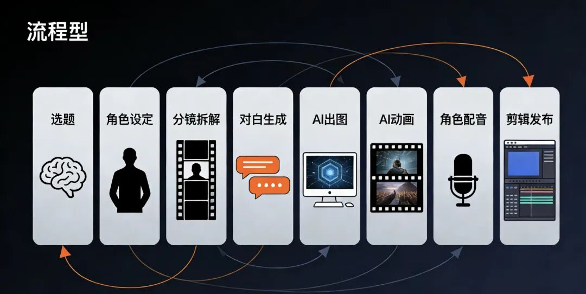

# 不露脸AI频道月赚10万+

**作者**: 痞开心AI
**原文链接**: https://mp.weixin.qq.com/s?src=11&timestamp=1779897106&ver=6746&signature=dLeh9sftuIyL9b3Eomg-deEEmFRH0v82FwxGb1SVAmG0sd8k2XHxTHo0S3CLRAHTVpbM5RifMOmYcyjCzZZYl3tvdHmEIvCaU8c69kxg0k-hohZrhDdOQspdbVvV8Kig&new=1
**抓取时间**: 2026-05-27 23:52:10

---
# 不露脸、不拍视频，这个AI频道竟然月赚10万+，我把它完整拆开了 如果我告诉你： 一个 没有真人露脸 、 
 几乎 不需要拍摄 、 
 每条视频只有 2~3分钟 的 YouTube 频道， 
 居然能做到 单条百万播放 ，月收入高达 6000~17000 美元 —— 你第一反应，大概率会是： 这是不是又一个“看起来很牛，但普通人根本做不了”的案例？ 但这次不一样。 因为我认真拆完之后发现： 
 这个频道最可怕的地方，不是它赚了多少钱， 
 而是它背后的模型，真的非常适合普通人用 AI 复刻。 它不是靠真人魅力，不是靠重资产拍摄，也不是靠复杂团队协作。 
 它真正跑通的，是一套非常清晰的内容公式： > 固定角色 + 固定选题模板 + AI流水线生产 + 可批量复制 说白了，这不是一个“天才频道”， 
 而是一台已经被验证过的 AI内容印钞机原型 。 今天，我就带你把它彻底拆开。 ## 一、这个频道到底做对了什么？ 先说结论： 它做的不是普通动画， 
 也不是普通搞笑短视频， 
 而是一个极其强势的内容模型： ### “如果世界没有___，会怎样？” 比如： - • 如果世界没有工作会怎样？
- • 如果世界没有规则会怎样？
- • 如果世界没有谎言会怎样？
- • 如果没有金钱会怎样？ 你别小看这个句式。 它厉害就厉害在——\ 几乎天然自带点击欲。 因为这种标题同时满足了 3 个传播核心： ### 1）一眼就懂 不需要教育用户，看到标题就知道你要讲什么。 ### 2）天然带悬念 “如果没有___会怎样”本身就是一个开放式脑洞，观众很难不点开。 ### 3）极适合短视频 不需要复杂叙事，开头几秒就能把观众拉进去。 很多人做内容总想着“拍得更高级”“工具更先进”， 
 但真正能跑出流量的，往往不是技术，而是： 有没有一个持续稳定的点击模型。 这个频道有，而且很强。 ## 二、为什么它适合用 AI 批量复制？ 因为这类内容有一个最大的优势： ### 结构高度标准化。 一条视频看起来是创意内容， 
 但背后其实可以被拆成固定流程：  - • 选题
- • 角色
- • 分镜
- • 对白
- • 出图
- • 动画
- • 配音
- • 剪辑
- • 包装 这意味着什么？ 意味着它不是“一次性创作”，而是可以被流程化、模板化、系统化。 而一旦内容能被系统化，AI 的价值就出来了。 很多人对 AI 的误解是： 
 “AI 能帮我写篇文案”“帮我出张图”。 但真正的高价值用法不是零散提效， 
 而是： > 把原本依赖个人灵感的创作过程，变成可重复执行的生产流程。 这才是这类频道最值得研究的地方。 ## 三、第一步不是做视频，而是先做“爆款选题机” 很多新手一上来就犯一个错误： 打开 ChatGPT，直接问一句： > “帮我想几个 YouTube 视频创意。” 这种做法最大的问题是： 
 AI 会给你很多“看起来像创意，实际上很难做成系列”的内容。 真正正确的做法是： ### 先把频道的“母题”钉死。 比如这个案例里，母题就是： > 如果世界没有___ 有了这个母题之后，AI 才能成为你的 选题倍增器 ，而不是创意噪音制造机。 你可以让它批量生成： - • “如果世界没有手机”
- • “如果世界没有睡眠”
- • “如果世界没有谎言”
- • “如果世界没有法律”
- • “如果世界没有钱” 注意，这一步的关键不是“多”， 
 而是“统一”。 因为统一的选题框架会带来两个结果： ### 第一，观众记得住你 他会知道你这个频道就是专门讲这类脑洞设定的。 ### 第二，你能持续做下去 当你母题定了，后面不是“每天重新想内容”， 
 而是“持续从同一个框架里往外扩”。 这就是一个频道开始具备“生产能力”的信号。 ## 四、真正拉开差距的，不是会不会用AI，而是会不会做“角色资产” 如果你认真观察大部分失败的 AI 账号，会发现一个共性： ### 每条内容都像新号。 角色不一样、画风不一样、节奏不一样、氛围也不一样。 
 观众看完这一条，根本记不住你。 而这个案例恰恰反过来： ### 它会反复使用固定角色。 这件事特别重要。 因为一旦角色固定，整个频道会立刻发生质变： - • 观众更容易形成记忆点
- • 角色关系会变成内容资产
- • 每期不需要重新生成全部设定
- • 后续制作效率会越来越高 这就是为什么我一直觉得： > AI 内容想赚钱，不能只追求“生成”，要追求“复利”。 而固定角色，就是最核心的复利资产之一。 你不需要一开始就设计十几个角色。 
 最实际的做法就是： - • 先做 2~3 个核心角色
- • 保证画风统一
- • 保证设定稳定
- • 后续所有视频围绕他们展开 一旦跑通，效率会越来越恐怖。 ## 五、2分钟的视频，最值钱的不是画面，是分镜能力 很多人以为做这种内容最难的是动画。 
 其实不是。 最难的是： ### 你知不知道这2分钟应该怎么讲。 一条 2 分钟视频，通常要拆成十几到二十多个镜头。 
 如果这些镜头只是“有画面”，但没有节奏、没有冲突、没有推进，那视频就会很空。 这也是为什么很多 AI 视频看着挺炫，但播放就是起不来。 因为它们只有“素材”，没有“叙事”。 真正高质量的做法应该是： ### 先让 AI 帮你做场景拆解 比如： - • 开头 3 秒用什么反差吸引人？
- • 中间哪几个镜头负责制造笑点？
- • 哪几个镜头负责推进设定？
- • 结尾怎么做回钩或反转？ 当你把这一步做好，AI 才是在帮你放大效率。 
 否则它只是帮你制造更多无效素材。 说白了： > AI 决定生产速度，分镜决定内容上限。 这一点，绝对是大多数人最容易忽略的地方。 ## 六、没有旁白，反而更考验“高级感” 这个案例还有一个很聪明的地方： 它不是靠大段解说推动内容， 
 而是尽量让角色对白、表情、动作和音乐共同完成叙事。 这意味着什么？ 意味着它天然更适合做海外传播。 因为： - • 语言依赖更低
- • 信息接受更轻
- • 情绪感受更直接 但这也意味着，你不能什么都让角色说出来。 很多人做短视频，一紧张就喜欢把信息塞满。 
 结果观众看着看着就累了。 真正有完成度的内容，恰恰知道什么时候该说，什么时候该停。 有些镜头只需要一个表情。 
 有些镜头只需要一段音乐。 
 有些地方不解释，反而更有味道。 这就是节奏感。 而节奏感，往往才是一条视频能不能被看完的关键。 ## 七、最后把素材变成作品的，是配音和剪辑 到这一步，其实你已经有了： - • 选题
- • 角色
- • 分镜
- • 画面
- • 对白 但这些仍然只是半成品。 真正让它从“AI拼接物”变成“能发出去的作品”，是最后两步： ## 1）角色配音稳定 同一个角色，必须尽量使用同一种声音。 
 否则观众一秒出戏。 ## 2）剪辑必须做减法 不要舍不得删。 
 能少一个镜头就少一个镜头，能少一句对白就少一句。 因为观众喜欢的不是“信息很多”， 
 而是“看起来顺”。 再加上一点合适的轻喜剧配乐， 
 这类视频的完整度就会明显提升。 很多人觉得剪辑只是体力活。 
 其实不是。 在 AI 内容时代，剪辑更像是： > 把低成本素材，重新组织成高价值观看体验。 这一步，依旧值钱。 ## 八、普通人想复制这类频道，应该怎么开始？ 如果你看完已经心动了，不要一上来就想着： “我要做一个月入10万的频道。” 没必要。 更靠谱的起点是： ### 第一步：先定一个系列母题 比如： - • 如果世界没有___
- • 如果人类失去___
- • 如果某个规则消失___ ### 第二步：先做3个稳定角色 不要追求多，先追求统一。 ### 第三步：先做一条2分钟样片 目标不是爆，而是先把流程闭环走一遍。 因为对普通人来说，最重要的不是先做大， 
 而是先验证： > 这套流程你能不能自己重复三次。 如果能重复三次，才有资格谈批量化。 
 如果能重复十次，才有资格谈规模化。 
 如果能稳定做一个月，才有资格谈变现。 ## 最后一句 这个案例最值得学的，不是“AI 很强”， 
 也不是“别人赚了多少钱”。 真正值得学的是： ### 他把创意，做成了系统； ### 把内容，做成了流水线； ### 把一次爆款，做成了可重复生产的模型。 这才是 AI 时代最可怕、也最值钱的能力。 不是你会不会一个新工具， 
 而是你能不能搭出一台持续产出的内容机器。