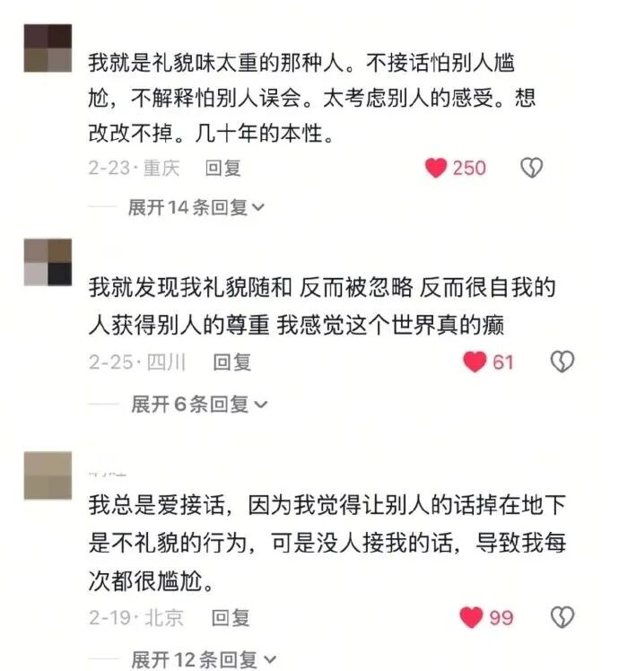
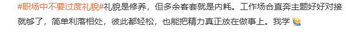
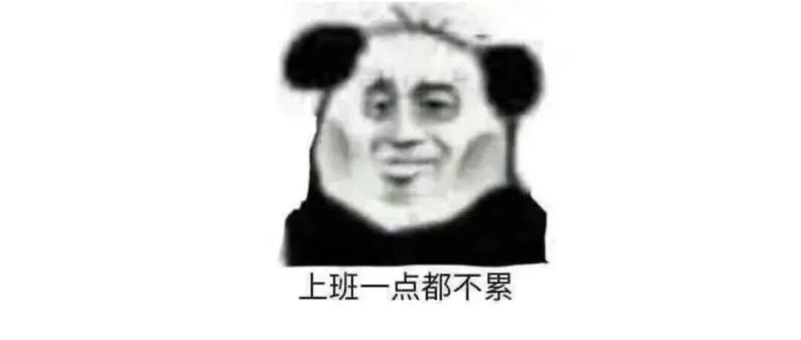
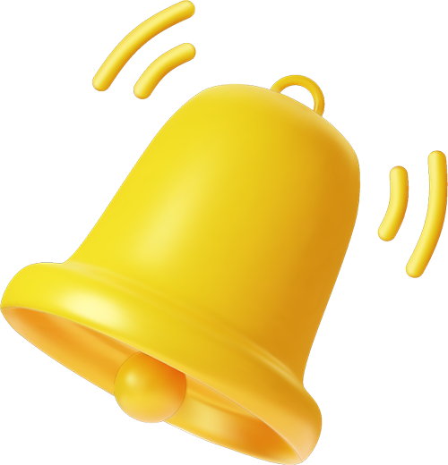
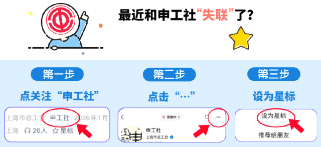

# “职场中不要过度礼貌”上热搜！网友吵翻了！你属于几度礼貌？

**作者**: 申工社
**原文链接**: https://mp.weixin.qq.com/s?src=11&timestamp=1779901247&ver=6746&signature=hFC7zyO1*L8sBdpdjdj0lR9NNMRga8pLjskneszpbQFoFGomRpfwu5*wW4o2*ZuzvAnfm*ygWBla*UKUVAsVnPcG*3VjXuTUEVfZCm-Ya6EY5btlXqCpmcp2X6YJUYM-&new=1
**抓取时间**: 2026-05-28 01:00:59

---
 
 职场中 你是不是也太 “好说话” 了？ 我们总以为， 越礼貌越受欢迎。 但事实上 在职场中保持过度礼貌， 真的好吗？ 此事登上热搜 引发网友讨论   
 
 在职场中，“过度礼貌”通常指在人际交往或工作沟通中，超出合理范围、显得不自然或不必要的礼貌行为，可能产生负面效果。 
 一些网友也分享了，自己在生活中“过度礼貌”的行为： - 不管什么工作，做完都反复说麻烦大家、辛苦各位；
- 被同事正常求助帮忙，自己没空还不停道歉，满心愧疚；
- 开会发言小心翼翼，句句带不好意思、冒昧问下、麻烦大家；
- 对接正常工作事宜，频繁连用谢谢、麻烦了、辛苦了客套堆砌；
- 别人拖延耽误进度，自己反倒主动开口致歉缓和气氛。 
 
  网友热评： 
 太过礼貌容易让自己失去尊重 
 - 大量网友表示，凡事讲究分寸，礼貌一旦“过度”，不仅耗费大量时间与精力，增加内耗，还可能传递“弱势信号”，引发轻视和恶意试探。  
 - 也有网友表示，职场上多一份礼貌多一份体面，谦和客气的相处方式，能维系良好同事关系，缓和沟通矛盾，是职场人际交往里不可或缺的相处之道。
- 当然，也有人觉得纠结职场礼貌是否过度本就无关紧要，比起花费心思琢磨社交礼数、拿捏待人分寸，专心踏实做好本职工作，提升自身业务能力才是重中之重。   
 
 
 
 职场里面 
 你有没有遇见过这样的场景 你属于几度礼貌？ 一起来参与小调查吧↓↓ 
 
 
 
 
  
 本期编辑：万弈 图片源自网络 
 
 往期话题  端茶倒水、打印送材料、订餐买奶茶……职场里的“Dirty work”，你会做吗？ 
  
 