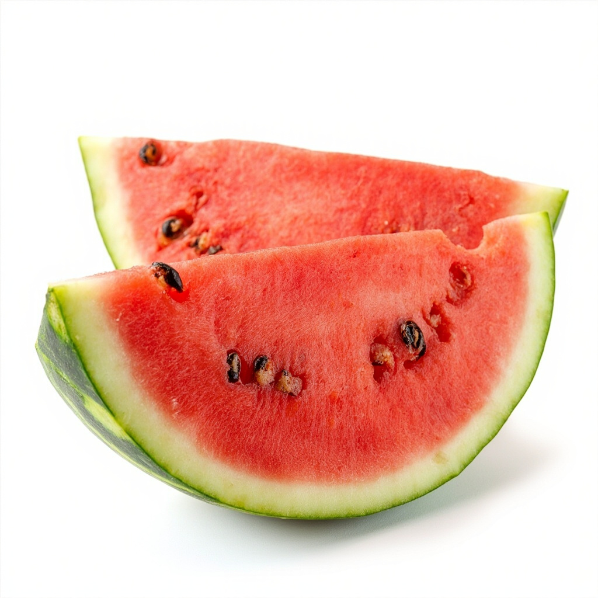
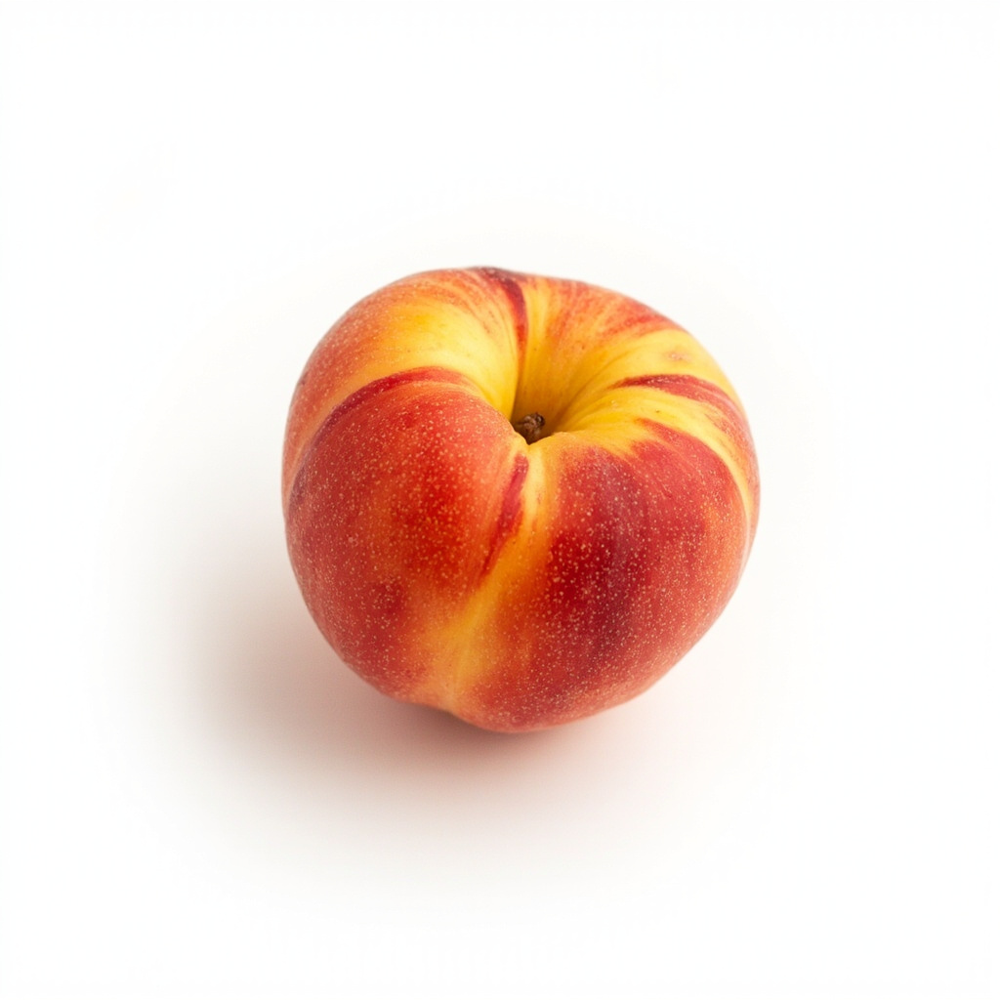
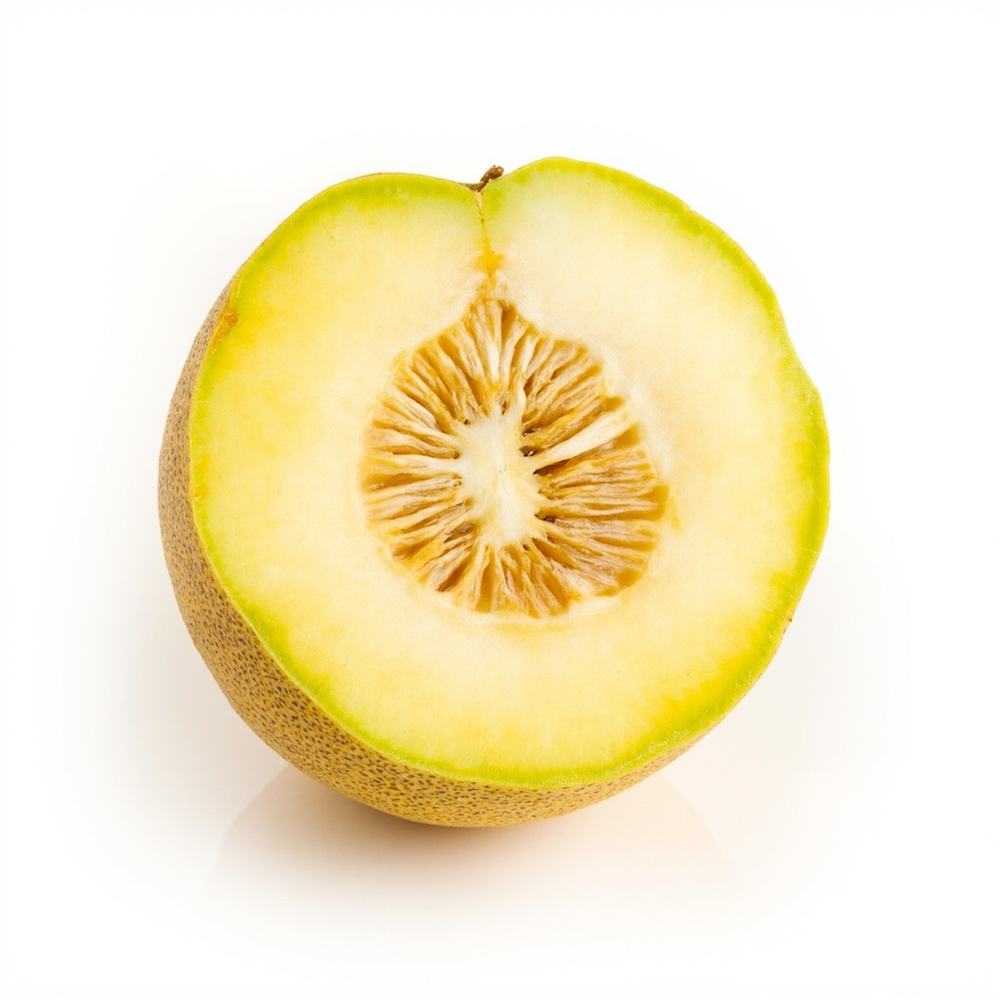
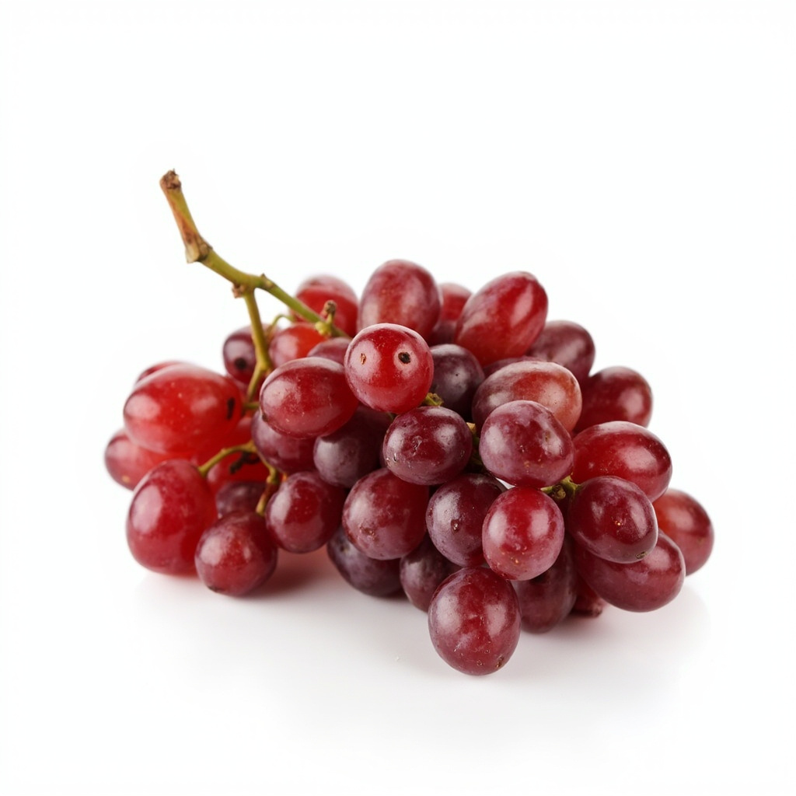
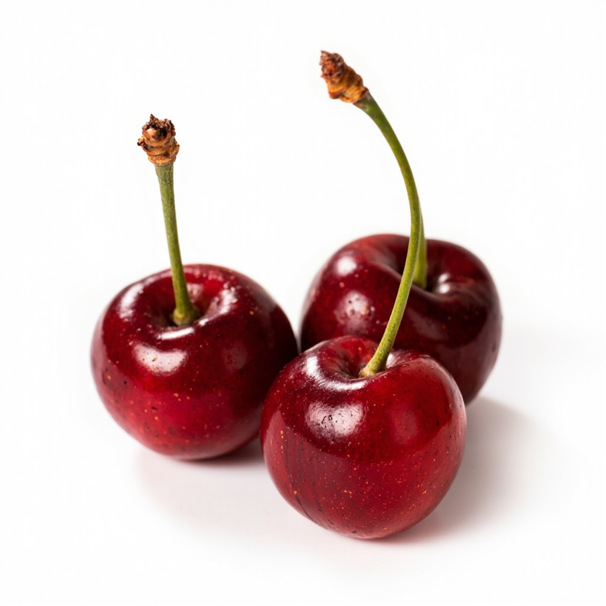
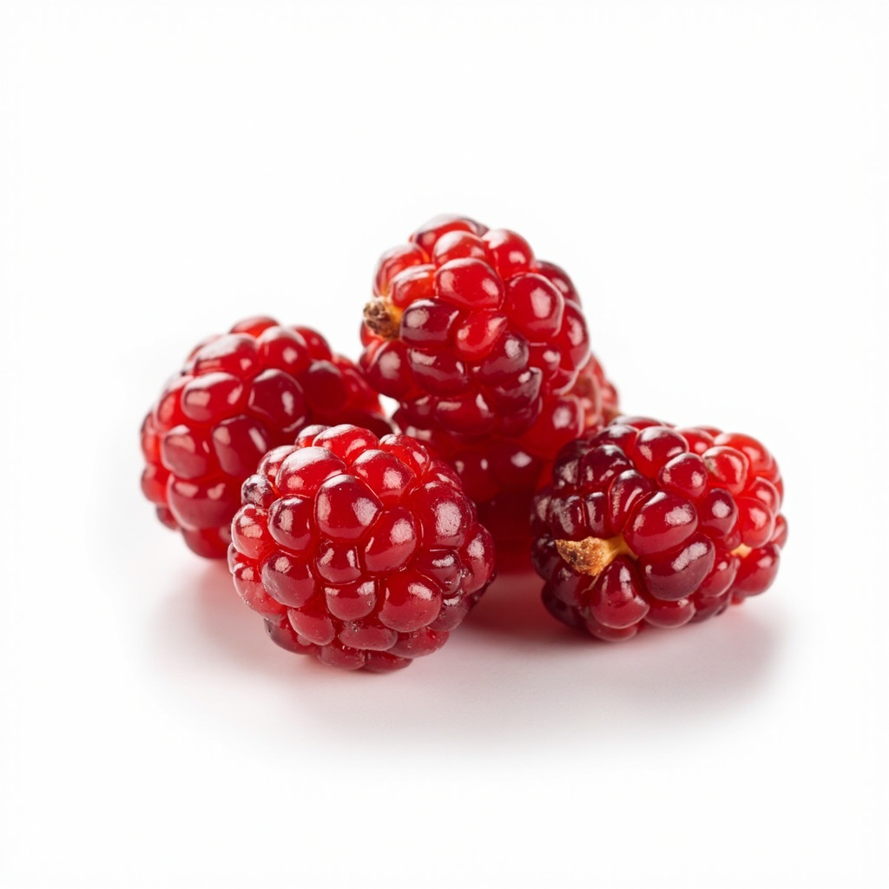
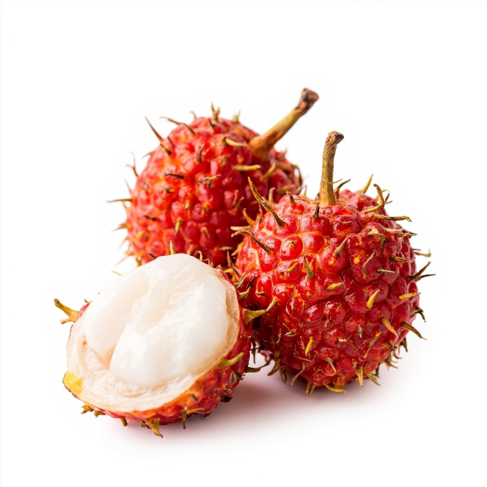
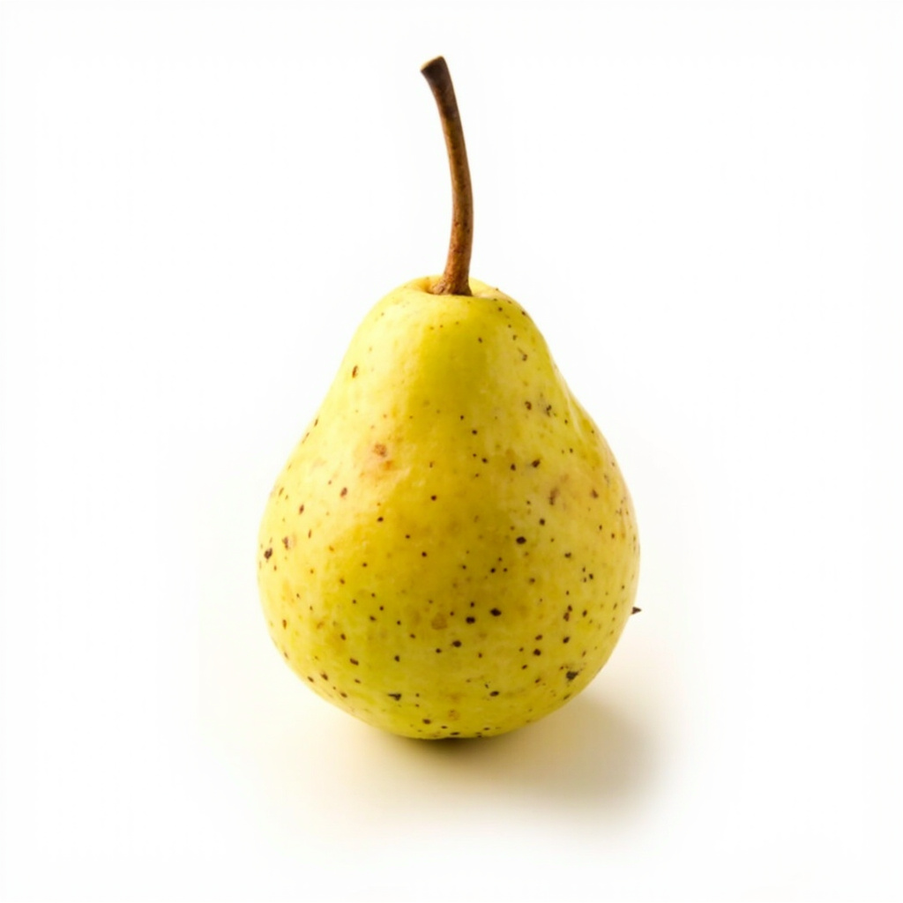

# 暑热伤人，这8种水果是夏季天然的"养生高手"，吃对了，清热生津安神

**作者**: 中国中医（基于国家中医药管理局官方内容整理）
**基于摘要改写**

---

夏天气温高、暑湿重，人容易出现心烦、口干、食欲不振等不适。中医讲究"顺时养生"，此时节养生应当以**清热解暑、生津止渴、健脾祛湿、养心安神**为核心原则。

以下8种时令水果是大自然赐予的养生佳品，依据中医性味归经合理选择、适量食用，既能享受鲜果美味，又能调理身体。

---

## 一、西瓜——清热解暑、除烦止渴

西瓜性寒、味甘，归心、胃、膀胱经。《随息居饮食谱》记载其可以**清肺热、解暑热、除烦止渴、醒酒凉营**，又被称为天生"白虎汤"。

**适合人群**：暑热引起的身热汗多、心烦、口渴、咽痛、大便干燥者。

**注意**：西瓜性寒，脾胃虚弱者、产妇不宜多食；多食易积寒助湿。

---

## 二、桃子——补心活血、止盗汗

桃子性味甘酸温，归心、肺经。《随息居饮食谱》记载桃子可**补心活血、止盗汗**，《饮膳正要》指出其可**利肺气、止咳逆上气**。

**适合人群**：气血亏虚、贫血、心悸、咳喘、口干渴、盗汗者。

**注意**：桃子多食易生热，患有痈疮者不宜多食。

---

## 三、哈密瓜——清肺热、利小便

哈密瓜味甘、性寒，归肺、膀胱经。《中医食疗学》记载其可**利小便、清肺热、止咳**。

**适合人群**：干咳或咳黄痰、燥热烦渴、口鼻生疮、小便黄者。

**注意**：哈密瓜含糖量较高，糖尿病人应谨慎食用；口味过甜的哈密瓜清热力量相对较弱。

---

## 四、葡萄——滋肝肾、强筋骨

葡萄性平、味甘酸，归肝、肾经。生食能**滋肝肾阴液、强筋骨**。

**适合人群**：肝肾阴虚、腰膝酸软、疲劳乏力者。

**注意**：葡萄性平，适宜人群广泛，可适量经常食用。

---

## 五、樱桃——养颜驻容、去皱消斑

樱桃是夏季不可缺少的水果，营养价值高，尤其含铁量居水果之冠。《本草纲目》记载其可**养颜驻容、去皱消斑**。

**适合人群**：食欲不振、消化不良、风湿身痛、缺铁性贫血者。

**注意**：糖尿病患者和易胀气的人不宜多食。

---

## 六、杨梅——解酒止渴、活血消痰

杨梅是南方夏季常见水果，性温、味酸甘。《随息居饮食谱》记载其可**解酒止渴、活血消痰、清肠胃**。

**适合人群**：饮酒者、瘀血者、痰多而白、口渴不欲饮水、腹胀者。

**注意**：杨梅性偏温，易上火者（牙龈肿痛、痰黄、咽痛）应减少食用；胃溃疡、胃炎患者应控制食用量。

---

## 七、荔枝——补心养肝、填精充液

荔枝性温、味甘香，归心、脾、肝经。《随息居饮食谱》记载其可**填精充液、益心养肝**。

**适合人群**：病后体虚、脾胃虚弱、津液不足、大便晨起腹泻、胃部肢体冷痛者。

**注意**：荔枝性热，多食易生痘疮、上火；食用后可饮少量淡盐水引火归元；含糖量高，糖尿病人不宜食用。

---

## 八、雪梨——生津润燥、清热化痰

雪梨性凉、味甘微酸，归肺、胃经。《随息居饮食谱》记载其可**生津润燥、清热化痰**。

**适合人群**：肺热咳嗽、咽喉干痒、口渴、便秘者。

**注意**：雪梨性凉，脾胃虚寒、风寒咳嗽者不宜生食，可炖煮后食用。

---

**温馨提示**：水果养生需根据个人体质选择，适量食用为宜。如有特殊健康问题，请咨询医师。