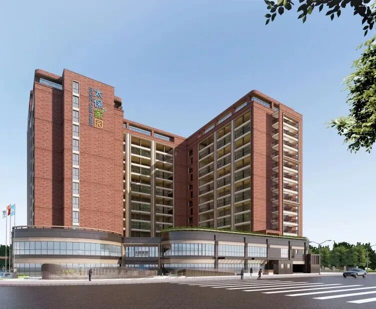
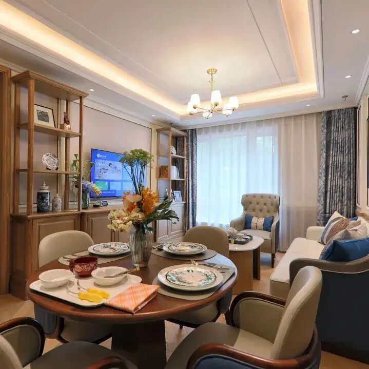
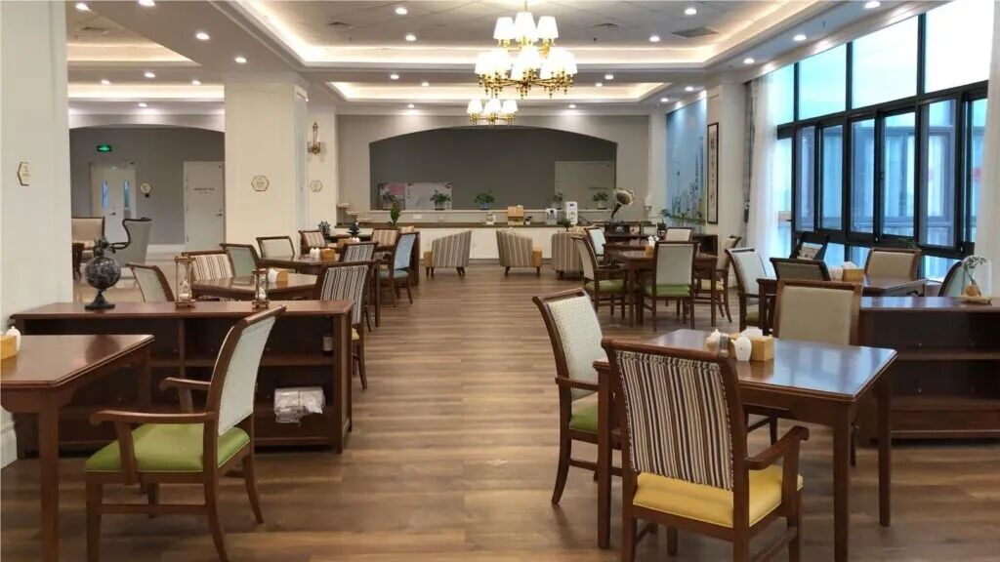
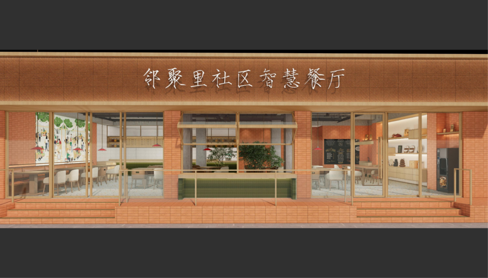
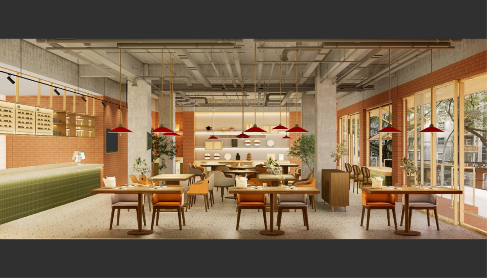
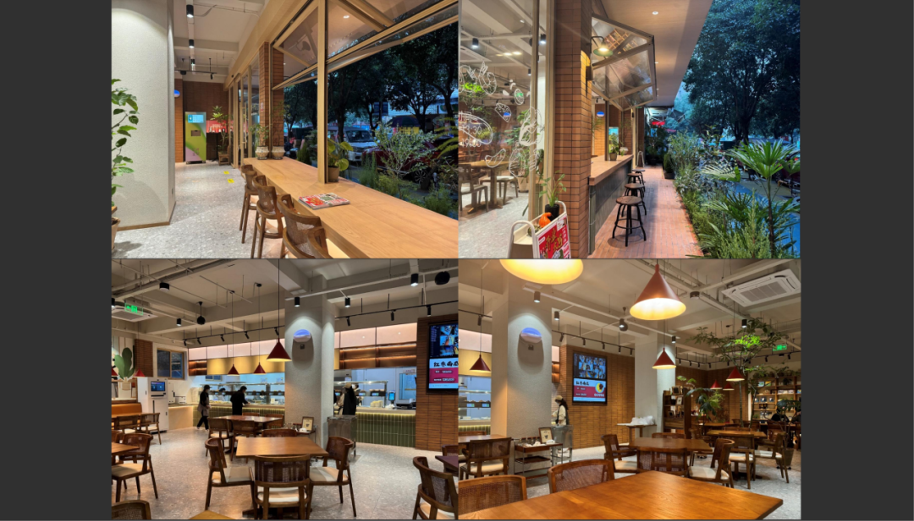
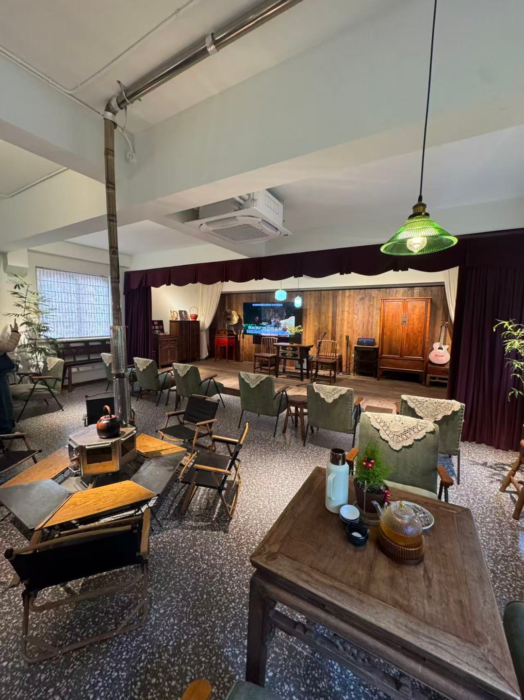
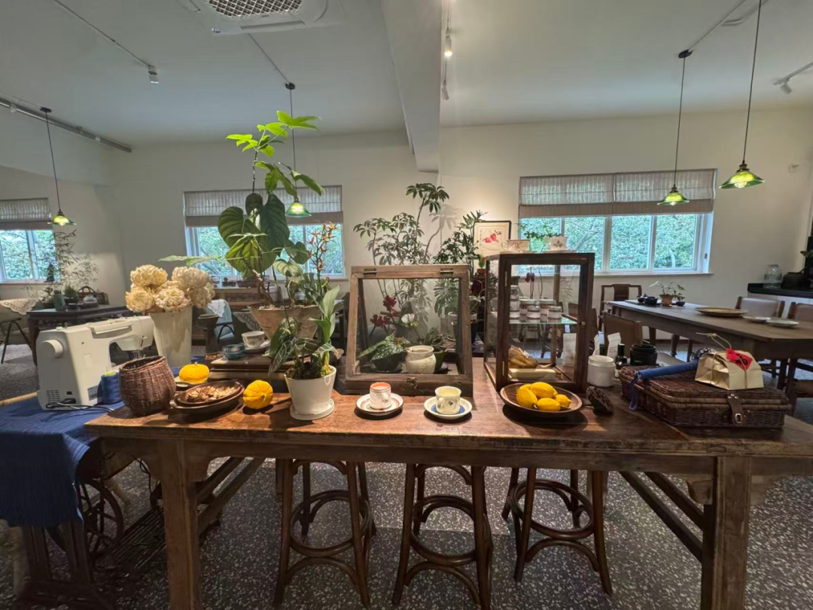
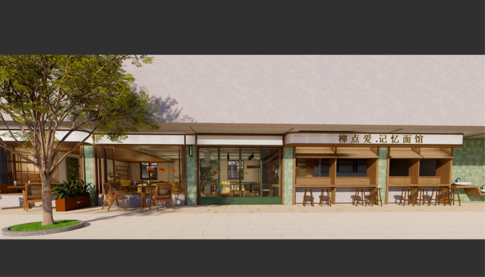
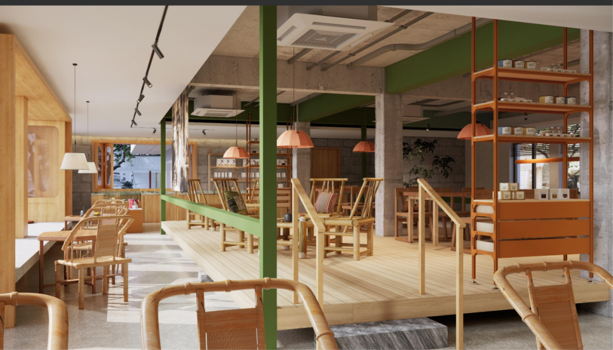

# 2026银发经济红利爆发：从"养老项目"到"康养运营"的"范式变革"

**作者**: 烩设计
**原文链接**: https://mp.weixin.qq.com/s?src=11&timestamp=1779901785&ver=6746&signature=o2ej1PWnlMHTd8bEPudUjDcXgA6Fk1I*P-ioGtchRkt4foOyT0HhRTrW4cxDT*hXz8mkaTeigp29w9aNF3zwWNoMc8-2Ivygkah3IM3kcHoc4o8*8kx-pxJgDqxcEDNo&new=1
**抓取时间**: 2026-05-28 01:10:11

---
SPRING 
 
 2026 银发经济 
 
 
 
  { 银发经济决胜局 } 
 市场前景 
 截至2025年年末，全国 60岁及以上人口为3.2338亿人 ，并且这个数字还在以 每年1000万 左右的速度增加。这些数据都预示着中国老龄化进程进入深水区。 
 人口结构问题，已经从"远在天边"变成的"迫在眉睫"。面对严峻的形势，国家也接连出台了一系列的政策，鼓励越来越多的企业来积极参与银发经济和养老产业当中。尝试在解决人口老龄化带来的负面影响同时，带动的银发经济的良性发展。 
 行业风向 
 近年，中央出台了一系列针对养老B端市场的政策。鼓励限制物业改建为养老项目。并有机会获得 低息贷款 。在今年 养老新政18条 出台后，一些 国央企 ，也在时隔多年后再度拿地。 
 行业现状 
 - 项目数量明显增长：近年，中央出台了一系列针对养老B端市场的政策。养老新政18条出台后，各地方城投公司也在政策的驱动下，开始进入养老行业。
- 新银发业态层出不穷：随着第二个婴儿潮的老人的退休。围绕着他们的需求，银发经济的各类新型业态不断涌现
- 专业人才缺乏： 目前就全国而言，专业从事养老项目的设计机构数量屈指可数。有丰富经验的成熟设计师更是少之又少。既懂运营又懂行业趋势的专家，更是凤毛麟角。 

 在B端市场，"适老化"早已不是简单的"无障碍设计"，而是一场涉及产品力、运营效率、风险控制与品牌溢价的系统工程。 
 
 【中国太平·梧桐人家】
 
 上海市浦东新区天花板养老机构 -上海太平梧桐人家康养社区 ，选址上海浦江东岸，由中国太平保险集团斥资 40亿元 打造的上海地区的大型旗舰养老社区。以上海市树梧桐命名，撷取" 凤栖梧桐 "，寓意人生有所历经后的美好归宿。梧桐人家以 Home(家)、Hotel(酒店)、Health& Hospital(健康医疗)、Happiness(幸福)、Holiday(旅行)5H 为服务理念，致力为长者带来自信、温暖、充实、愉悦的乐龄生活。
   
 自2019年投入运营以来，其" 安新家 "的理念和高品质的综合服务，使其入住率持续走高，已成为 业内公认的"常青树" 项目，目前享有超高的人气与欢迎度，是众多家庭选择高品质养老生活的首选目的地。
 它凭借" 活力生活、专业照护、康复医疗 "三位一体的业态布局，以及近90项贴心服务和40余类适老设施，赢得了市场的高度认可。
  
 活力养老区包含14栋养老公寓，1栋为颐养公寓（提供给偏护理的长者），1栋为公寓酒店（提供给试住或者长者家属短住），1栋为中心会所（提供各类配套设施的场所），其余皆为活力养老公寓。活力社区的东侧为配套二级太平康复医院（提供体检，健康管理、康复理疗等一系列的服务）和配套商业街。

 【太保静安】
 
 太保家园·上海静安国际康养社区 ， 是中国太保旗下太保家园在上海静安布局的城市型康养项目。项目总建筑面积约 3.1万平方米，通过改建改造方式建设，可提供近 240套护理单元和记忆照护单元、近 500个护理床位，并集 医、康、养 于一体。
 
 太保静安很关键的一点，是官方提出将以项目为中心，开展社区居家养老服务，打造 15分钟"社区养老服务圈" ，并依托太保家园在医疗、照护方面的优势，为5—10公里内高龄长者提供 生活护理、慢病管理、营养管理、起居照护等上门服务。
  
 太保家园代表的是 银发经济中"城市型医康养社区"的方向 。它不同于传统养老院单纯提供床位，而是依托中国太保的 品牌、资金与养老服务体系 ，在上海中心城区通过改建改造打造 集护理、康复、记忆照护、医疗协同和社区居家服务 于一体的品质型普惠养老社区。

 一方面承接高龄、失能、认知症和康复型长者的专业照护需求；另一方面以项目为中心向周边社区延展上门护理、慢病管理、营养管理和起居照护服务， 形成"机构养老为核心、社区居家为外延、保险金融为支撑"的城市银发经济模式。

 【红日咏华】
 
 上海红日咏华养老公寓 是红日养老旗下偏高端、文化型、适老化设计感较强的养老公寓项目，其位于 上海市浦东新区博兴路 。
 上海红日咏华，是把传统养老院升级成 " 有上海记忆、有生活尊严、有文化陪伴"的养老公寓 ， 用老上海弄堂文化、适老化空间和专业照护服务，回应城市老人对安全、照护、情感归属和体面生活的综合需求。
 
 上海红日咏华养老公寓，是银发经济中"文化型品质养老"的代表案例。它没有把养老机构做成冰冷的护理空间，而是以老上海弄堂文化为灵感，通过同福里、大亨弄堂、蓝妮弄堂等主题空间，把城市记忆、生活尊严和专业照护结合起来，为长者创造熟悉、温暖、有归属感的养老环境。
 
 用空间文化解决老人入住机构后的心理落差，用适老化设计保障安全与便利，用专业服务承接日常照护需求，用情绪价值提升家庭决策信任，最终形成一个 兼具养老功能、文化记忆和品牌辨识度的品质养老样本 。

 【宁波花开堇粲 智慧餐厅】
  
 宁波花开堇粲智慧餐厅 也是邻聚里社区智慧餐厅，被称为"很会赚钱"的社区食堂。这家餐厅以社区老人为主要客群，不是单纯做老年食堂，而是把"一顿饭"做成银发经济的社区入口： 用高频刚需餐饮聚集老人，再延展到健康管理、社区社交、适老零售、上门服务和养老服务转介。
  
 邻聚里不是年轻化网红餐厅，而是围绕老人真实需求设计：防滑设施、适老洗手台和通道、整洁明亮环境、低盐少糖软烂菜品、40种荤素搭配菜品、年龄优惠、行动不便老人送餐上门。它解决的是"老人敢来、愿意来、经常来"的问题。
 它以助餐解决民生刚需，以智慧化提升运营效率，以适老化空间建立信任，以健康管理和社区服务延展商业价值，最终形成"政府支持、企业运营、老人受益、社区增温"的可持续银发经济样本。

 【东柳街道月季社区 居家养老服务站】
 
 宁波东柳街道月季社区居家养老服务站 是一个典型的"社区嵌入式居家养老服务节点"，也是社区银发经济从"餐饮入口"走向"照护入口"的典型样本。
 
 它以居家养老为核心，把 家政服务、医疗服务、文化活动、精神慰藉和365必到服务 整合到社区场景中，让老人不用离开熟悉的生活环境，也能获得连续、可及、有温度的养老支持。
 用社区站点连接 老人家庭、养老资源、医疗资源和社会服务 ，把分散的养老需求转化为可识别、可响应、可运营的服务体系，形成 "政府支持、社区承接、专业服务、家庭受益" 的 社区银发经济模式。

 【东柳·柳点爱面馆茶馆】
 
 东柳·柳点爱面馆茶馆 ，位于宁波市鄞州区东柳街道东柳坊。它的起点来自社区老人提出"东柳坊能否有个老年食堂方便吃饭"的真实需求，随后通过空间改造和专业运营，形成现在的复合型社区餐饮空间。
 
 东柳·柳点爱面馆茶馆，是宁波社区银发经济中非常有启发性的样本。它没有把老年食堂做成单一的福利型供餐点，而是通过"面馆+茶馆+咖啡馆+零售+公益工坊"的复合业态，把 老年助餐、年轻消费、社区社交、公益就业和适老零售 融合在一起。
 柳点爱最特别的地方，是 它不是只服务老人，而是形成了真正的 全龄共享客群。
  
 用老年助餐解决民生刚需，用爆款餐饮吸引全龄客群，用茶馆和咖啡提升空间停留，用零售和公益工坊延展收入结构，最终形成一个 既有温度、又有流量、还能自我造血的社区银发经济模型。