# 2026银发经济红利爆发：从“养老项目”到“康养运营”的“范式变革”

**作者**: 烩设计
**原文链接**: https://mp.weixin.qq.com/s?src=11&timestamp=1779901785&ver=6746&signature=o2ej1PWnlMHTd8bEPudUjDcXgA6Fk1I*P-ioGtchRkt4foOyT0HhRTrW4cxDT*hXz8mkaTeigp29w9aNF3zwWNoMc8-2Ivygkah3IM3kcHoc4o8*8kx-pxJgDqxcEDNo&new=1
**抓取时间**: 2026-05-28 01:10:11

---
SPRING 
 
 2026 银发经济 
 
 
 
  { 银发经济决胜局 } 
 市场前景 
 截至2025年年末，全国 60岁及以上人口为3.2338亿人 ，并且这个数字还在以 每年1000万 左右的速度增加。这些数据都预示着中国老龄化进程进入深水区。 
 人口结构问题，已经从“远在天边”变成的“迫在眉睫”。面对严峻的形势，国家也接连出台了一系列的政策，鼓励越来越多的企业来积极参与银发经济和养老产业当中。尝试在解决人口老龄化带来的负面影响同时，带动的银发经济的良性发展。 
 行业风向 
 近年，中央出台了一系列针对养老B端市场的政策。鼓励限制物业改建为养老项目。并有机会获得 低息贷款 。在今年 养老新政18条 出台后，一些 国央企 ，也在时隔多年后再度拿地。 
 行业现状 
 - 项目数量明显增长：近年，中央出台了一系列针对养老B端市场的政策。养老新政18条出台后，各地方城投公司也在政策的驱动下，开始进入养老行业。
- 新银发业态层出不穷：随着第二个婴儿潮的老人的退休。围绕着他们的需求，银发经济的各类新型业态不断涌现
- 专业人才缺乏： 目前就全国而言，专业从事养老项目的设计机构数量屈指可数。有丰富经验的成熟设计师更是少之又少。既懂运营又懂行业趋势的专家，更是凤毛麟角。 
 问题永远会与机遇并存，在房产行业下行的当下。作为设计师（设计公司），如何能在 “朝气蓬勃”的银发产业中占有自己的一席之地，是每个设计人都需要考虑的问题。 
 在B端市场，“适老化”早已不是简单的“无障碍设计”，而是一场涉及产品力、运营效率、风险控制与品牌溢价的系统工程。 
 上海标杆养老社区 
 【中国太平·梧桐人家】 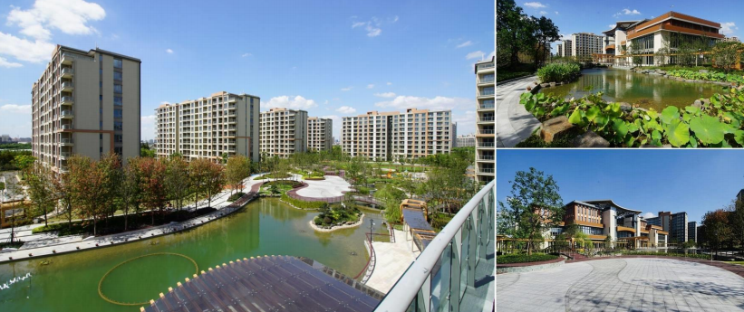 上海市浦东新区天花板养老机构 -上海太平梧桐人家康养社区 ，选址上海浦江东岸，由中国太平保险集团斥资 40亿元 打造的上海地区的大型旗舰养老社区。以上海市树梧桐命名，撷取“ 凤栖梧桐 ”，寓意人生有所历经后的美好归宿。梧桐人家以 Home(家)、Hotel(酒店)、Health& Hospital(健康医疗)、Happiness(幸福)、Holiday(旅行)5H 为服务理念，致力为长者带来自信、温暖、充实、愉悦的乐龄生活。 
 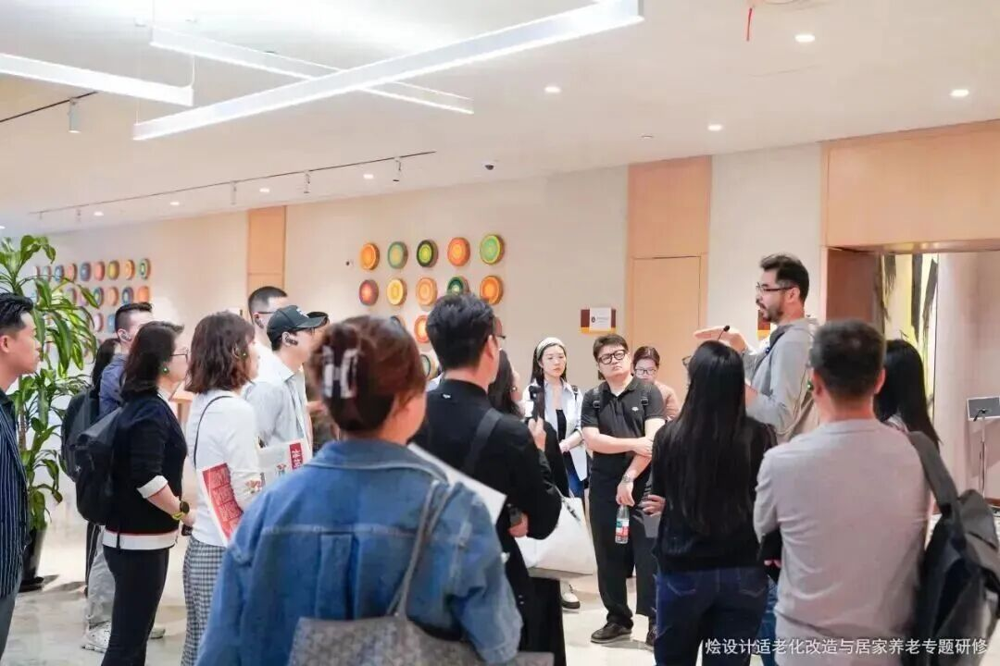 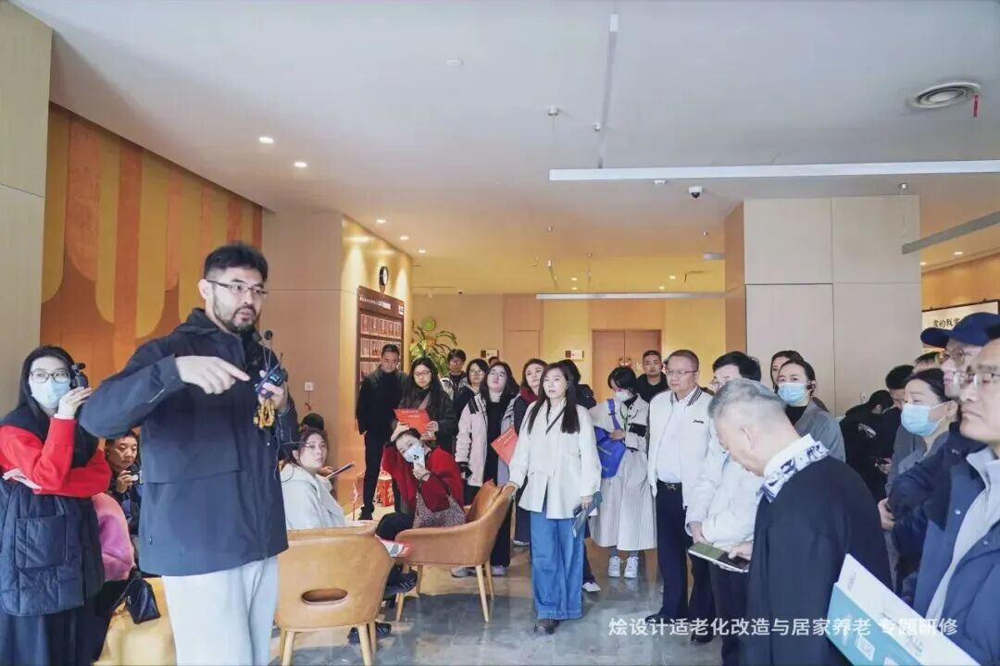 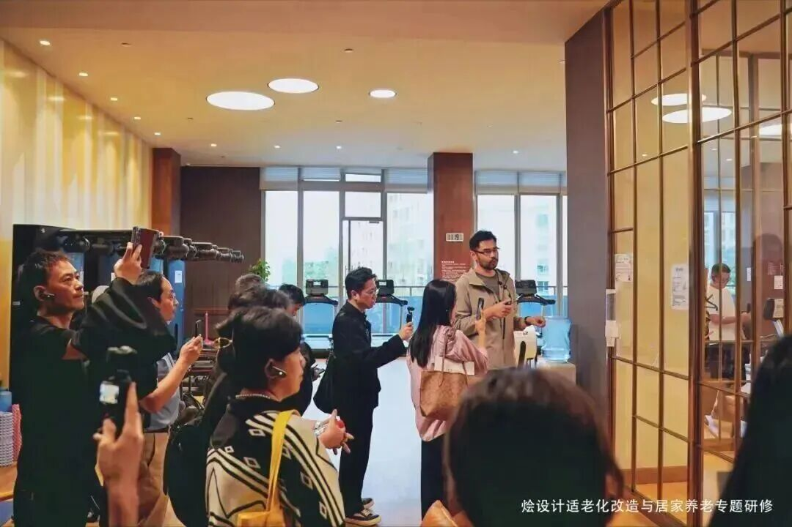 自2019年投入运营以来，其“ 安新家 ”的理念和高品质的综合服务，使其入住率持续走高，已成为 业内公认的“常青树” 项目，目前享有超高的人气与欢迎度，是众多家庭选择高品质养老生活的首选目的地。 
 它凭借“ 活力生活、专业照护、康复医疗 ”三位一体的业态布局，以及近90项贴心服务和40余类适老设施，赢得了市场的高度认可。 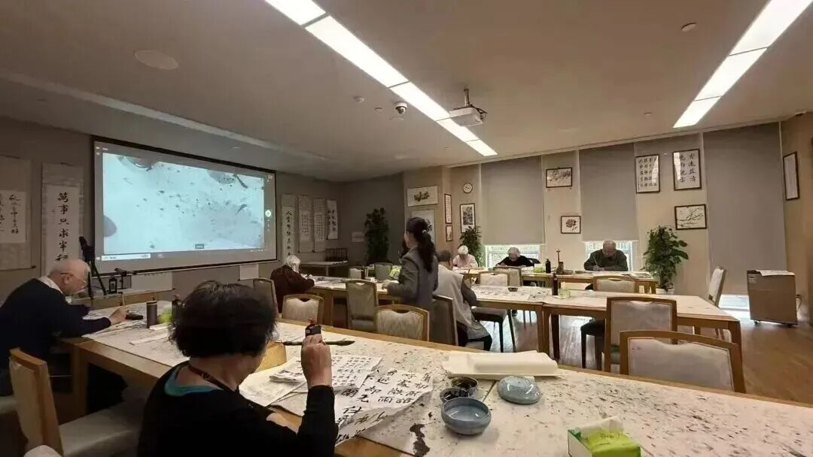 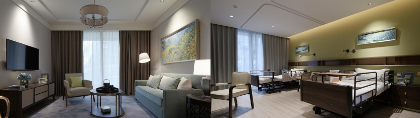 活力养老区包含14栋养老公寓，1栋为颐养公寓（提供给偏护理的长者），1栋为公寓酒店（提供给试住或者长者家属短住），1栋为中心会所（提供各类配套设施的场所），其余皆为活力养老公寓。活力社区的东侧为配套二级太平康复医院（提供体检，健康管理、康复理疗等一系列的服务）和配套商业街。 
 【太保静安】  太保家园·上海静安国际康养社区 ， 是中国太保旗下太保家园在上海静安布局的城市型康养项目。项目总建筑面积约 3.1万平方米，通过改建改造方式建设，可提供近 240套护理单元和记忆照护单元、近 500个护理床位，并集 医、康、养 于一体。 
 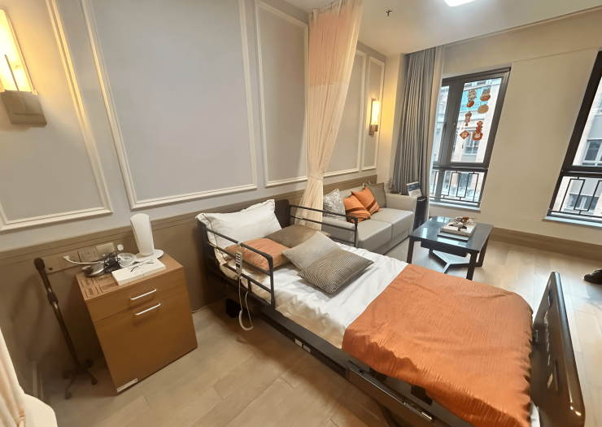 太保静安很关键的一点，是官方提出将以项目为中心，开展社区居家养老服务，打造 15分钟“社区养老服务圈” ，并依托太保家园在医疗、照护方面的优势，为5—10公里内高龄长者提供 生活护理、慢病管理、营养管理、起居照护等上门服务。  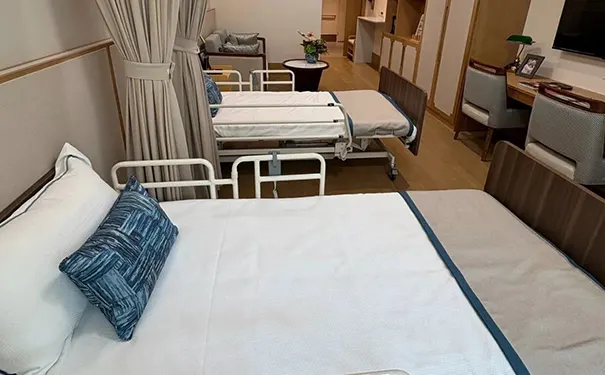 
 太保家园代表的是 银发经济中“城市型医康养社区”的方向 。它不同于传统养老院单纯提供床位，而是依托中国太保的 品牌、资金与养老服务体系 ，在上海中心城区通过改建改造打造 集护理、康复、记忆照护、医疗协同和社区居家服务 于一体的品质型普惠养老社区。 
 一方面承接高龄、失能、认知症和康复型长者的专业照护需求；另一方面以项目为中心向周边社区延展上门护理、慢病管理、营养管理和起居照护服务， 形成“机构养老为核心、社区居家为外延、保险金融为支撑”的城市银发经济模式。 
 【红日咏华】 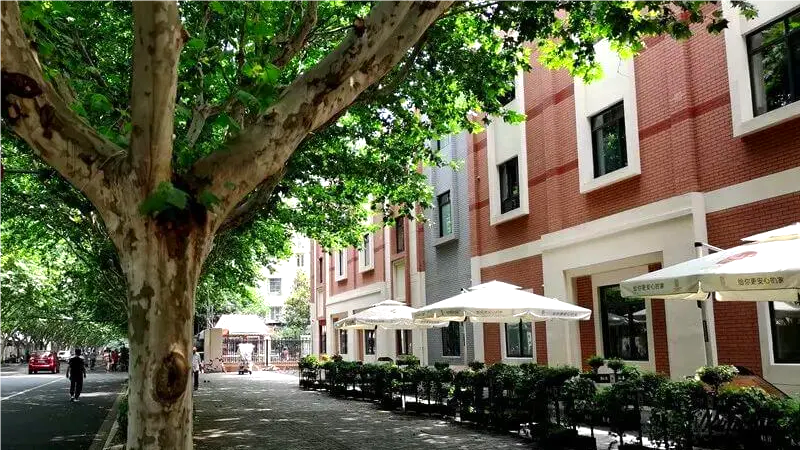 上海市红日咏华养老公寓 是红日养老旗下偏高端、文化型、适老化设计感较强的养老公寓项目，其位于 上海市浦东新区博兴路 。 
 上海红日咏华，是把传统养老院升级成 “ 有上海记忆、有生活尊严、有文化陪伴”的养老公寓 ， 用老上海弄堂文化、适老化空间和专业照护服务，回应城市老人对安全、照护、情感归属和体面生活的综合需求。 
 它和普通养老院最大的区别，不是 单 纯做床位和护理，而是把 空间记忆、文化情绪、照护服务和生活方式 结合起来。  上海红日咏华养老公寓，是银发经济中“文化型品质养老”的代表案例。它没有把养老机构做成冰冷的护理空间，而是以老上海弄堂文化为灵感，通过同福里、大亨弄堂、蓝妮弄堂等主题空间，把城市记忆、生活尊严和专业照护结合起来，为长者创造熟悉、温暖、有归属感的养老环境。 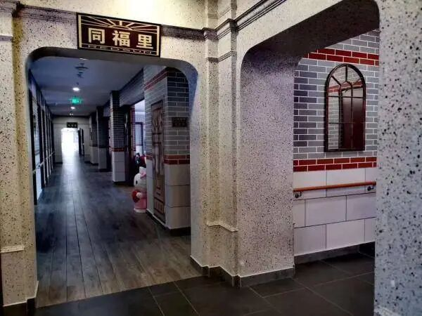 用空间文化解决老人入住机构后的心理落差，用适老化设计保障安全与便利，用专业服务承接日常照护需求，用情绪价值提升家庭决策信任，最终形成一个 兼具养老功能、文化记忆和品牌辨识度的品质养老样本 。 
 
 宁波社区类银发经济模型 【宁波花开堇粲 智慧餐厅】 
 
 
 宁波花开堇粲智慧餐厅也是-邻聚里社区智慧餐厅- 被称为“很会赚钱”的社区食堂，这家餐厅以社区老人为主要客群，不是单纯做老年食堂，而是把“一顿饭”做成银发经济的社区入口： 用高频刚需餐饮聚集老人，再延展到健康管理、社区社交、适老零售、上门服务和养老服务转介。   邻聚里不是年轻化网红餐厅，而是围绕老人真实需求设计：防滑设施、适老洗手台和通道、整洁明亮环境、低盐少糖软烂菜品、40种荤素搭配菜品、年龄优惠、行动不便老人送餐上门。它解决的是“老人敢来、愿意来、经常来”的问题。 
 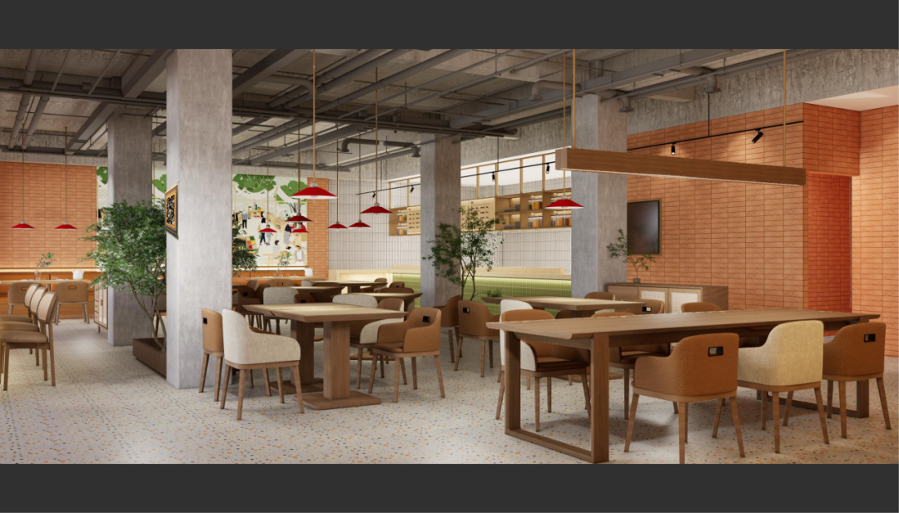  它以助餐解决民生刚需，以智慧化提升运营效率，以适老化空间建立信任，以健康管理和社区服务延展商业价值，最终形成“政府支持、企业运营、老人受益、社区增温”的可持续银发经济样本。 
 【东柳街道月季社区 
 居家养老服务站】 宁波东柳街道月季社区居家养老服务站 位于宁波市鄞州区东柳街道月季社区百宁街 ，是一个典型的“社区嵌入式居家养老服务节点”，也是社区银发经济从“餐饮入口”走向“照护入口”的典型样本。  它以居家养老为核心，把 家政服务、医疗服务、文化活动、精神慰藉和365必到服务 整合到社区场景中，让老人不用离开熟悉的生活环境，也能获得连续、可及、有温度的养老支持。  用社区站点连接 老人家庭、养老资源、医疗资源和社会服务 ，把分散的养老需求转化为可识别、可响应、可运营的服务体系，形成 “政府支持、社区承接、专业服务、家庭受益” 的 社区银发经济模式。 
 
 【东柳.柳点爱面馆茶馆】  东柳·柳点爱面馆茶馆 ，位于宁波市鄞州区东柳街道东柳坊。它的起点来自社区老人提出“东柳坊能否有个老年食堂方便吃饭”的真实需求，随后通过空间改造和专业运营，形成现在的复合型社区餐饮空间，由 社区需求驱动、街道资源协调、专业机构运营、市场化方式承接 的社区养老更新项目。 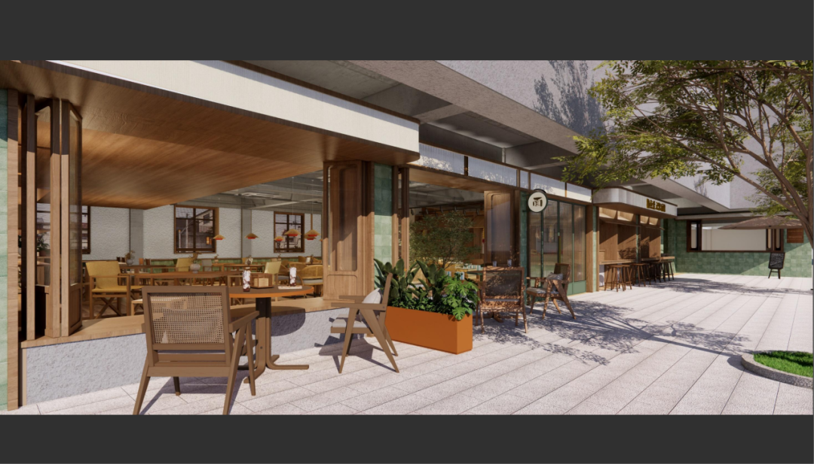 东柳·柳点爱面馆茶馆，是宁波社区银发经济中非常有启发性的样本。它没有把老年食堂做成单一的福利型供餐点，而是通过“面馆+茶馆+咖啡馆+零售+公益工坊”的复合业态，把 老年助餐、年轻消费、社区社交、公益就业和适老零售 融合在一起。 柳点爱最特别的地方，是 它不是只服务老人，而是形成了真正的 全龄共享客群。 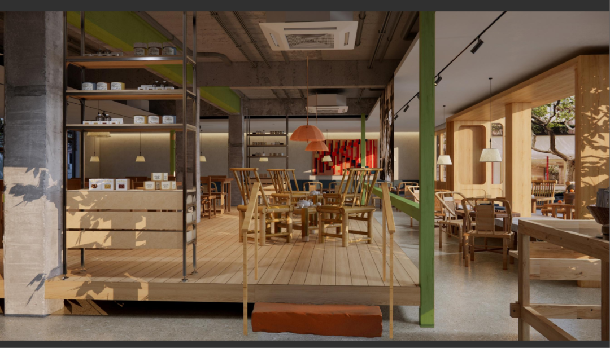  用老年助餐解决民生刚需，用爆款餐饮吸引全龄客群，用茶馆和咖啡提升空间停留，用零售和公益工坊延展收入结构，最终形成一个 既有温度、又有流量、还能自我造血的社区银发经济模型。 
 01 
 课程介绍 
 
 2026年7月《烩设计适老化改造和居家养老·专题研修班》B端1期，开启一场“理论高度×实战深度×现场温度”的三天闭门研修。 专为房企、设计院、康养运营商及产业链领袖等定制，这不仅是一次学习，更是一次企业战略升级的起点。 特邀两位行业TOP专家导师联袂授课： 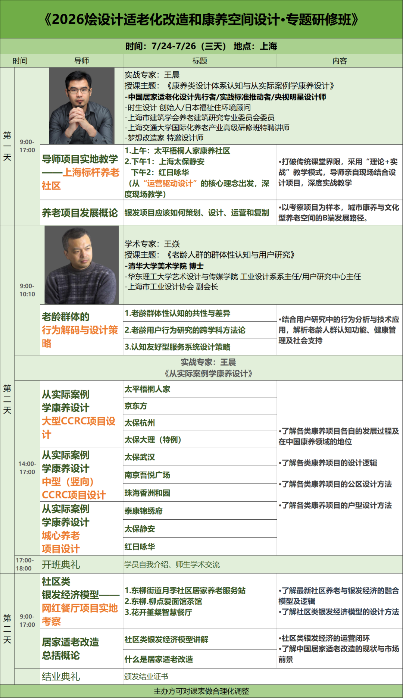 权威学术专家 —— 王 焱/清华博士： 深度解析“老龄用户真实需求”，从老龄人群的群体性认知、行为特征、心理变化与用户研究方法出发，帮助企业真正理解： 老人到底需要什么？ 
 家属真正担心什么？ 
 不同健康状态下的空间需求如何变化？ 
 如何建立认知友好型服务系统？ 
 央视明星设计师——王晨/时生设计创始人/ 日本福社住环境顾问： 16年200+项目实战， 从真实项目出发，拆解大型CCRC、城市中心康养、社区养老、居家适老化改造等不同模型。 重点解决企业最关心的问题： 方案如何落地？ 
 空间如何服务运营？ 
 存量项目如何更新？ 
 社区养老如何形成现金流？ 
 居家适老化如何从工程变成持续服务？ 
 课程将通过实际案例，系统性的教授学员如何应对各类的养老项目。除了讲解基础的养老空间设计外，更会从运营的视角出发，告诉大家，养老设计的基本逻辑。并将从养老产业和银发经济的维度出发剖析 养老业态的未来趋势与可能性。 
 咨询/报名-华老师  
 02 
 课程内容详情 
 
 导师-王焱 《老龄人群的群体性认知与用户研究》 
 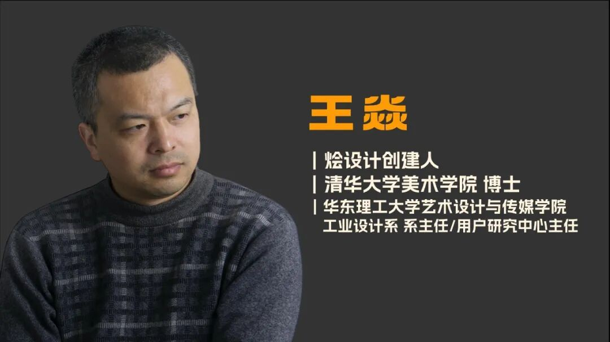 - 烩设计创建人 - 清华大学美术学院 博士 - 华东理工大学艺术设计与传媒学院 工业设计系系主任/用户研究中心主任 -上海工业设计协会 副会长 - 中国设计红星奖/评委 
 代表项目/ 亚洲食文化研究（香港设计营商周）、生活方式形态模型（东京-亚洲设计大会）、未来设计的组织形式（杭州-亚洲设计管理论坛）、分布式经济的设计探索（清华大学国际论坛）、用户研究方法论（UXPA） 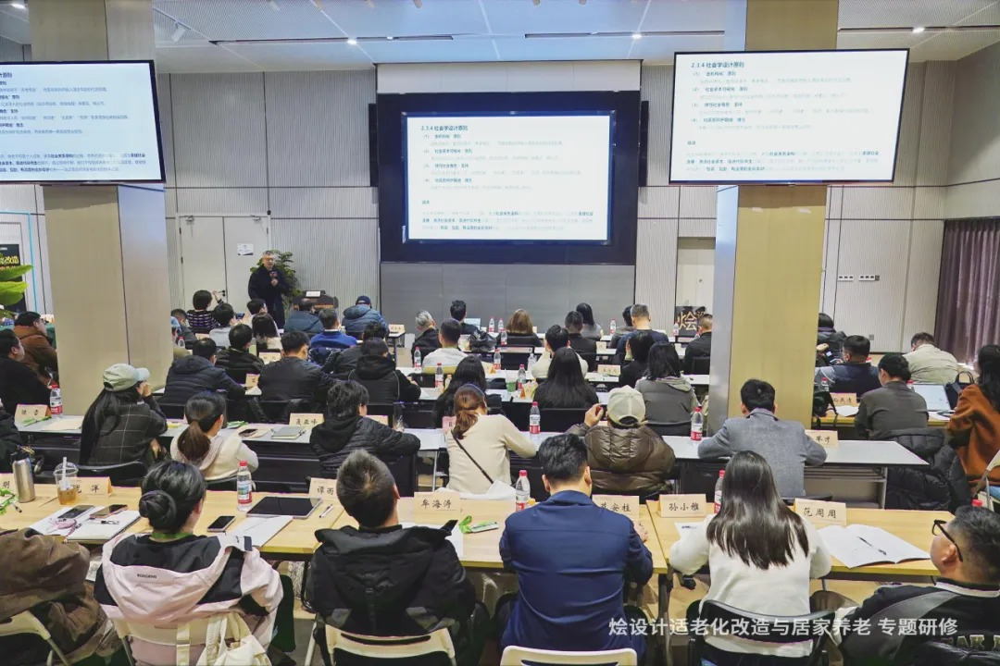 解析“新老人”的认知特征与行为差异，教你从医学与心理学视角出发，做“懂人”的有效设计。 
 
 重点聚焦以下三个核心内容： 一. 老龄群体性认知的共性与差异 
 二. 老龄用户行为研究的跨学科方法论 
 三. 认知友好型服务系统设计策略 
 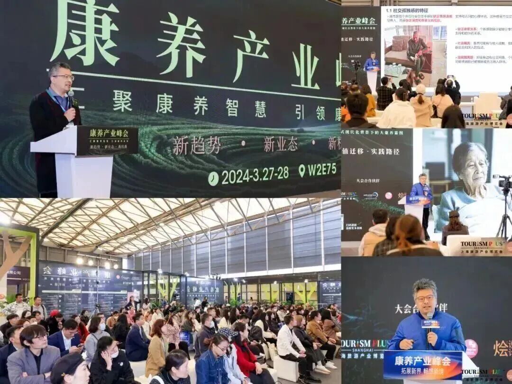 （王焱老师上海康养产业峰会代表发言） 
 
 导师-王晨 《康养类设计体系认知 与从实际案例学康养设计》 
  -时生设计 创始人 -日本福祉住环境顾问 -日本文理大学 建筑系 硕士 -日本二级建筑师 -上海市建筑学会养老建筑研究专业委员会 委员 -上海市残疾人联合会 无障碍设计顾问 -上海交通大学国际化养老产业高级研修班 特聘讲师 -上海市残疾人家庭无障碍改造业务培训班 特约讲师 -China Aid 专业养老展 策划人 设计师 -《梦想改造家》特邀设计师 
 代表项目/ 太平梧桐人家、泰康锦绣府、平安合悦江南、北京君康年华等高端康养社区等等 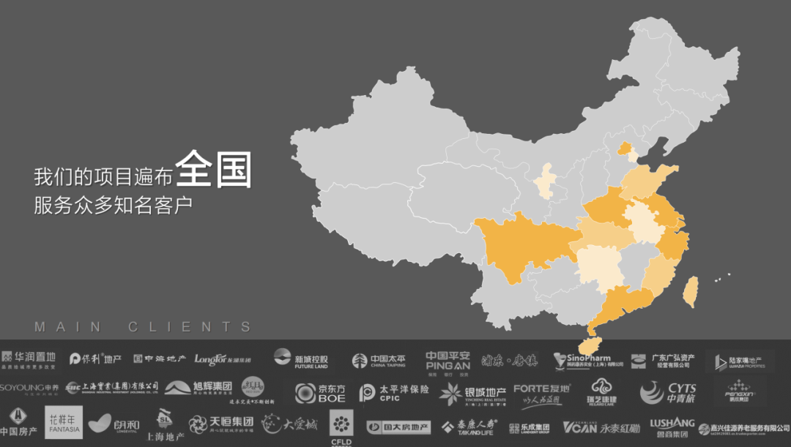  
 王晨老师是国内康养空间设计的先行者，央视明星设计师 。本次课程将从 实际案例出发，将结合多个头部项目进行深度拆解， 你将看到： 大型保险资本如何做高端康养社区； 
 城市核心区项目如何做高密度医康养综合体； 
 存量资产如何通过设计更新提升床位与房间效率； 
 社区嵌入式项目如何用餐饮、社群、服务形成高频入口； 
 居家适老化如何从一次性改造，延伸为评估、设计、施工、复评、维护的服务闭环。 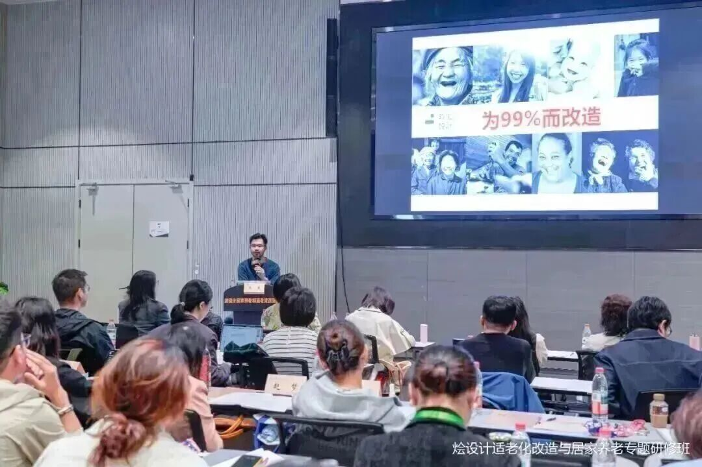 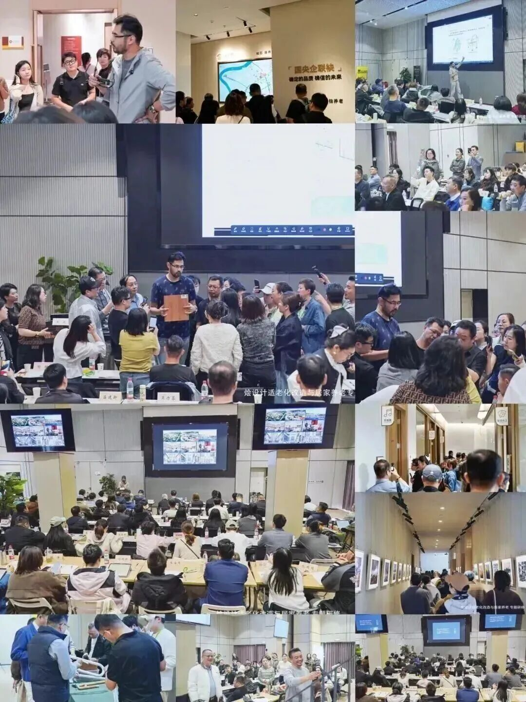 
 
 03 
 考察导师项目 本次课程采用“课程+实战”的教学模式，突破传统课堂界限，亲历现场，深度研学。 王晨老师深入解析，结合真实场景，从“ 运营驱动设计 ”的核心 理念出发，为学员进行了深度的现场实战教学，项目在规划逻辑、空间布局、服务动线与用户体验上的精妙设计，带来了一场沉浸式的专业学习体验。 
 上海标杆养老社区 
 【中国太平·梧桐人家】  上海市浦东新区天花板养老机构 -上海太平梧桐人家康养社区 ，选址上海浦江东岸，由中国太平保险集团斥资 40亿元 打造的上海地区的大型旗舰养老社区。以上海市树梧桐命名，撷取“ 凤栖梧桐 ”，寓意人生有所历经后的美好归宿。梧桐人家以 Home(家)、Hotel(酒店)、Health& Hospital(健康医疗)、Happiness(幸福)、Holiday(旅行)5H 为服务理念，致力为长者带来自信、温暖、充实、愉悦的乐龄生活。 
    自2019年投入运营以来，其“ 安新家 ”的理念和高品质的综合服务，使其入住率持续走高，已成为 业内公认的“常青树” 项目，目前享有超高的人气与欢迎度，是众多家庭选择高品质养老生活的首选目的地。 
 它凭借“ 活力生活、专业照护、康复医疗 ”三位一体的业态布局，以及近90项贴心服务和40余类适老设施，赢得了市场的高度认可。   活力养老区包含14栋养老公寓，1栋为颐养公寓（提供给偏护理的长者），1栋为公寓酒店（提供给试住或者长者家属短住），1栋为中心会所（提供各类配套设施的场所），其余皆为活力养老公寓。活力社区的东侧为配套二级太平康复医院（提供体检，健康管理、康复理疗等一系列的服务）和配套商业街。 【太保静安】  太保家园·上海静安国际康养社区 ， 是中国太保旗下太保家园在上海静安布局的城市型康养项目。项目总建筑面积约 3.1万平方米，通过改建改造方式建设，可提供近 240套护理单元和记忆照护单元、近 500个护理床位，并集 医、康、养 于一体。 
  太保静安很关键的一点，是官方提出将以项目为中心，开展社区居家养老服务，打造 15分钟“社区养老服务圈” ，并依托太保家园在医疗、照护方面的优势，为5—10公里内高龄长者提供 生活护理、慢病管理、营养管理、起居照护等上门服务。   太保家园代表的是 银发经济中“城市型医康养社区”的方向 。它不同于传统养老院单纯提供床位，而是依托中国太保的 品牌、资金与养老服务体系 ，在上海中心城区通过改建改造打造 集护理、康复、记忆照护、医疗协同和社区居家服务 于一体的品质型普惠养老社区。 
 一方面承接高龄、失能、认知症和康复型长者的专业照护需求；另一方面以项目为中心向周边社区延展上门护理、慢病管理、营养管理和起居照护服务， 形成“机构养老为核心、社区居家为外延、保险金融为支撑”的城市银发经济模式。 
 【红日咏华】  上海市红日咏华养老公寓 是红日养老旗下偏高端、文化型、适老化设计感较强的养老公寓项目，其位于 上海市浦东新区博兴路 。 
 上海红日咏华，是把传统养老院升级成 “ 有上海记忆、有生活尊严、有文化陪伴”的养老公寓 ， 用老上海弄堂文化、适老化空间和专业照护服务，回应城市老人对安全、照护、情感归属和体面生活的综合需求。 
 它和普通养老院最大的区别，不是 单 纯做床位和护理，而是把 空间记忆、文化情绪、照护服务和生活方式 结合起来。  上海红日咏华养老公寓，是银发经济中“文化型品质养老”的代表案例。它没有把养老机构做成冰冷的护理空间，而是以老上海弄堂文化为灵感，通过同福里、大亨弄堂、蓝妮弄堂等主题空间，把城市记忆、生活尊严和专业照护结合起来，为长者创造熟悉、温暖、有归属感的养老环境。  用空间文化解决老人入住机构后的心理落差，用适老化设计保障安全与便利，用专业服务承接日常照护需求，用情绪价值提升家庭决策信任，最终形成一个 兼具养老功能、文化记忆和品牌辨识度的品质养老样本 。 
 
 宁波社区类银发经济模型 【宁波花开堇粲 智慧餐厅】 
 
 
 宁波花开堇粲智慧餐厅也是-邻聚里社区智慧餐厅- 被称为“很会赚钱”的社区食堂，这家餐厅以社区老人为主要客群，不是单纯做老年食堂，而是把“一顿饭”做成银发经济的社区入口： 用高频刚需餐饮聚集老人，再延展到健康管理、社区社交、适老零售、上门服务和养老服务转介。   邻聚里不是年轻化网红餐厅，而是围绕老人真实需求设计：防滑设施、适老洗手台和通道、整洁明亮环境、低盐少糖软烂菜品、40种荤素搭配菜品、年龄优惠、行动不便老人送餐上门。它解决的是“老人敢来、愿意来、经常来”的问题。 
   它以助餐解决民生刚需，以智慧化提升运营效率，以适老化空间建立信任，以健康管理和社区服务延展商业价值，最终形成“政府支持、企业运营、老人受益、社区增温”的可持续银发经济样本。 
 【东柳街道月季社区 
 居家养老服务站】 宁波东柳街道月季社区居家养老服务站 位于宁波市鄞州区东柳街道月季社区百宁街 ，是一个典型的“社区嵌入式居家养老服务节点”，也是社区银发经济从“餐饮入口”走向“照护入口”的典型样本。  它以居家养老为核心，把 家政服务、医疗服务、文化活动、精神慰藉和365必到服务 整合到社区场景中，让老人不用离开熟悉的生活环境，也能获得连续、可及、有温度的养老支持。  用社区站点连接 老人家庭、养老资源、医疗资源和社会服务 ，把分散的养老需求转化为可识别、可响应、可运营的服务体系，形成 “政府支持、社区承接、专业服务、家庭受益” 的 社区银发经济模式。 
 
 【东柳.柳点爱面馆茶馆】  东柳·柳点爱面馆茶馆 ，位于宁波市鄞州区东柳街道东柳坊。它的起点来自社区老人提出“东柳坊能否有个老年食堂方便吃饭”的真实需求，随后通过空间改造和专业运营，形成现在的复合型社区餐饮空间，由 社区需求驱动、街道资源协调、专业机构运营、市场化方式承接 的社区养老更新项目。  东柳·柳点爱面馆茶馆，是宁波社区银发经济中非常有启发性的样本。它没有把老年食堂做成单一的福利型供餐点，而是通过“面馆+茶馆+咖啡馆+零售+公益工坊”的复合业态，把 老年助餐、年轻消费、社区社交、公益就业和适老零售 融合在一起。 柳点爱最特别的地方，是 它不是只服务老人，而是形成了真正的 全龄共享客群。   用老年助餐解决民生刚需，用爆款餐饮吸引全龄客群，用茶馆和咖啡提升空间停留，用零售和公益工坊延展收入结构，最终形成一个 既有温度、又有流量、还能自我造血的社区银发经济模型。 04 
 导师项目作品 
 瑞芝颐养山庄 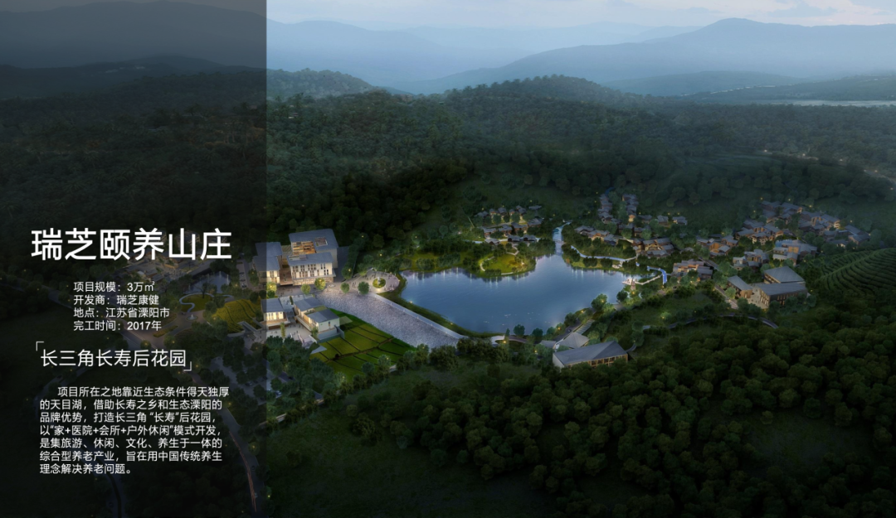 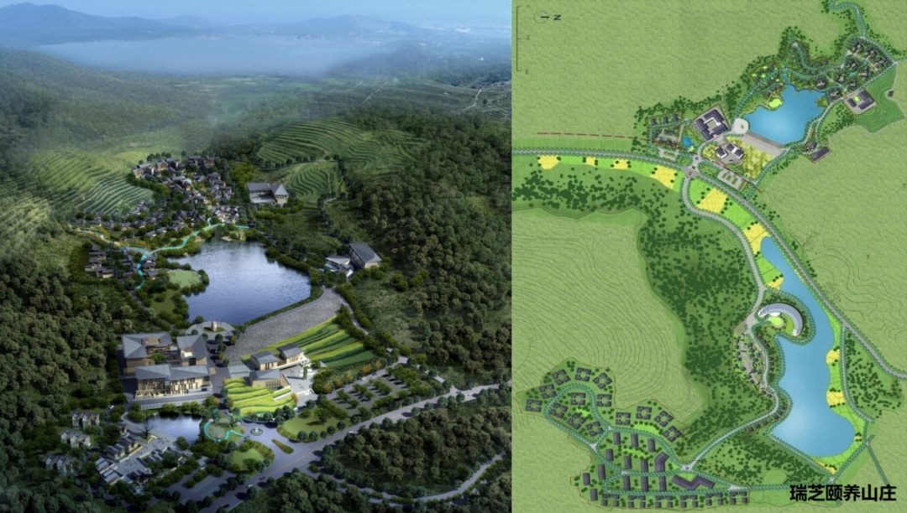 
 项目所在之地靠近生态条件得天独厚的天目湖，借助长寿之乡和生态溧阳的品牌优势，打造长三角 “长寿”后花园，以“家+医院+会所+户外休闲”模式开发，是集旅游、休闲、文化、养生于一体的综合型养老产业。 
 泰康·锦绣府 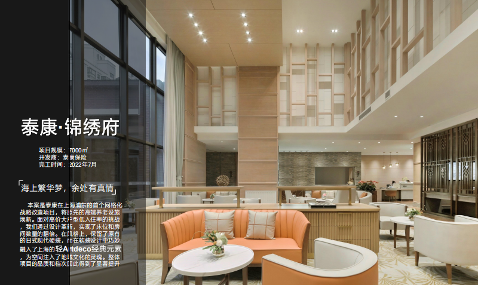 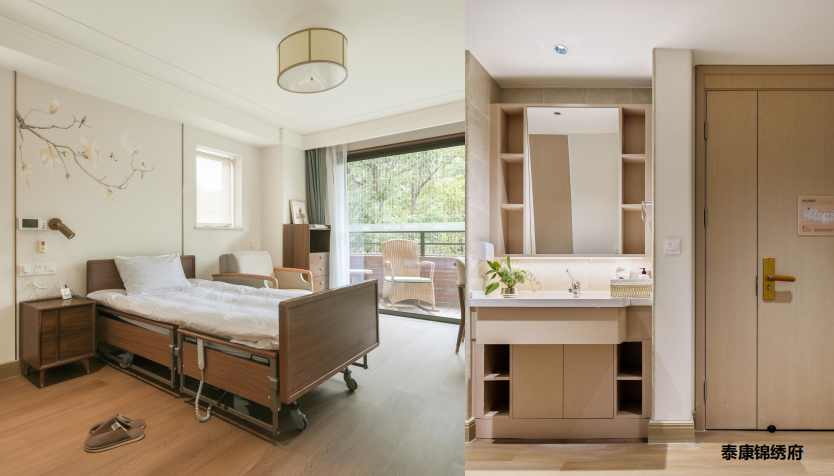 
 本案是泰康在上海浦东的首个网格化战略改造项目，将原先的高端养老设施焕新。通过设计革新，实现了床位和房间数量的翻倍。在风格上，保留了原有的日式现代硬装，而在软装设计中巧妙融入了上海的轻Artdeco经典元素，为空间注入了地域文化的灵魂。 
 太保家园·杭州 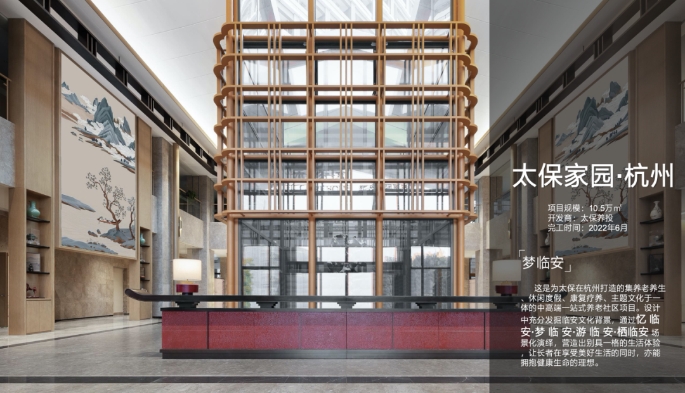 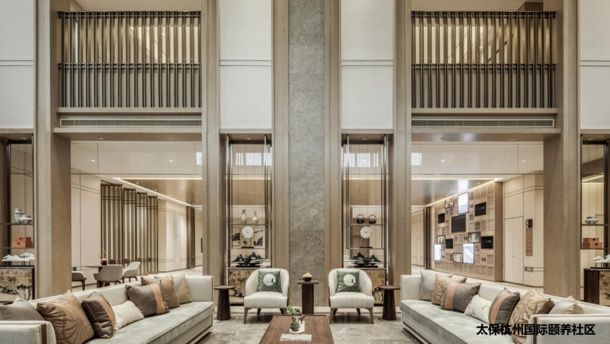 
 这是为太保在杭州打造的集养老养生，休闲度假、康复疗养、主题文化于一体的中高端一站式养老社区项目，让长者在享受美好生活的同时，亦能拥抱健康生命的理想。 
 陆家嘴·金色阳光 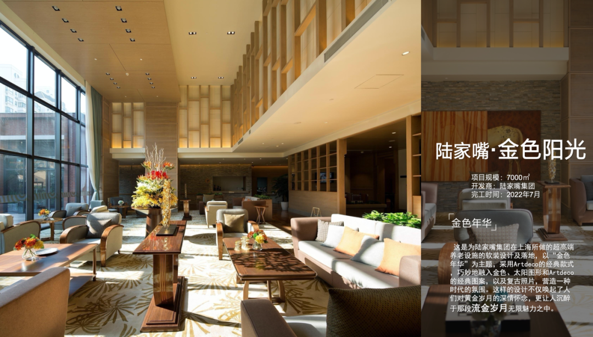 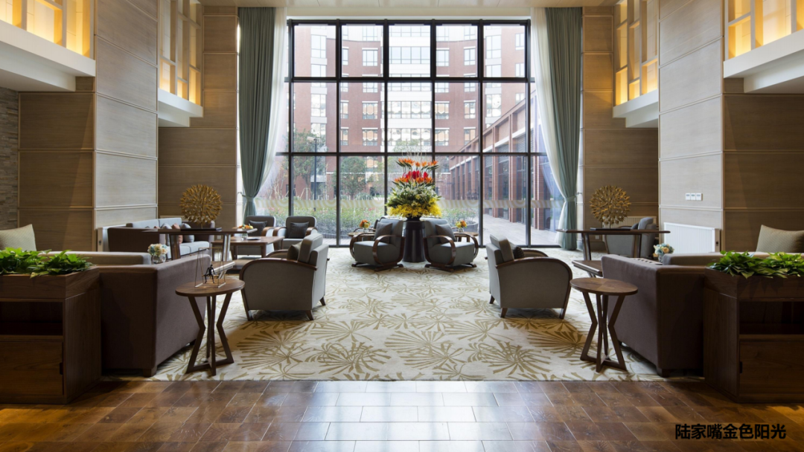 
 这是为陆家嘴集团在上海所做的超高端养老设施的软装设计及落地，以“金色年华”为主题，采用Artdeco的经典款式，营造一种时代的氛围。 
 平安合悦江南 「老人的乐园」 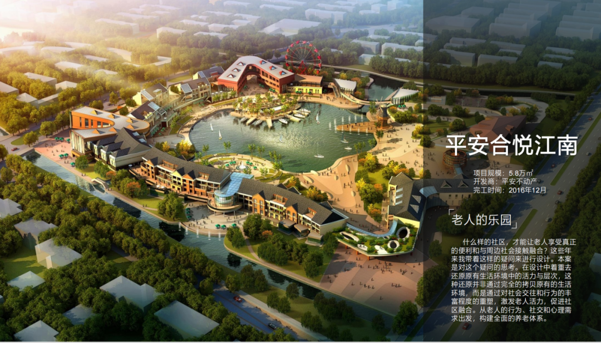 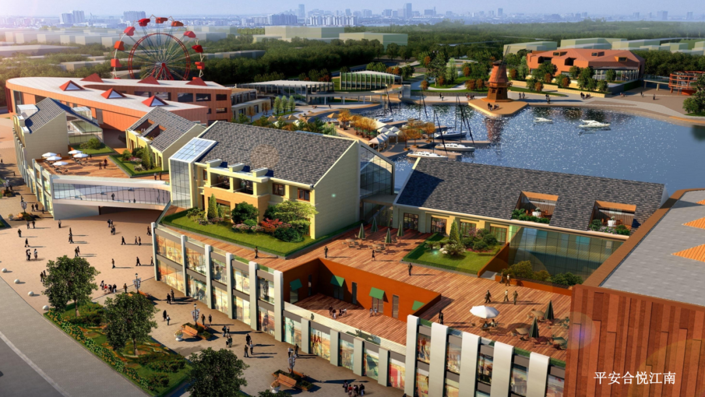 
 什么样的社区，才能让老人享受真正的便利和与周边社会接触融合？这些年来我带着这样的疑问来进行设计。本案是对这个疑问的思考。在设计中着重去还原原有生活环境中的活力与层次，这种还原并非通过完全的拷贝原有的生活环境，而是通过对社会交往和行为的丰富程度的重塑，激发老人活力，促进社区融合。从老人的行为、社交和心理需求出发，构建全面的养老体系。 
 
 05 
 绝对干货课堂 
 超棒班级氛围 
 《烩设计适老化改造与居家养老·专题研修班》往期研修  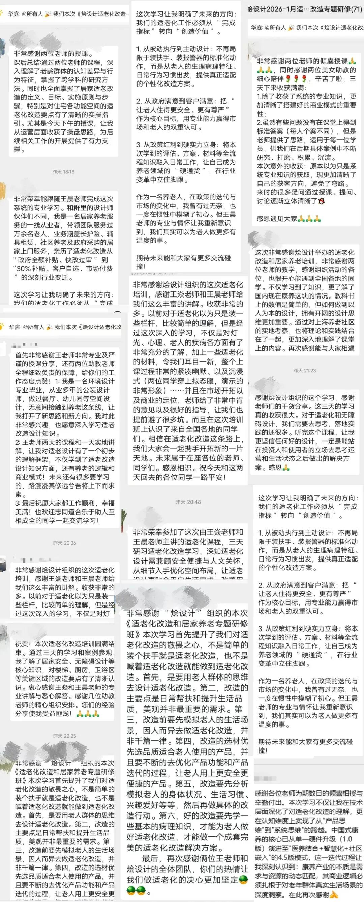   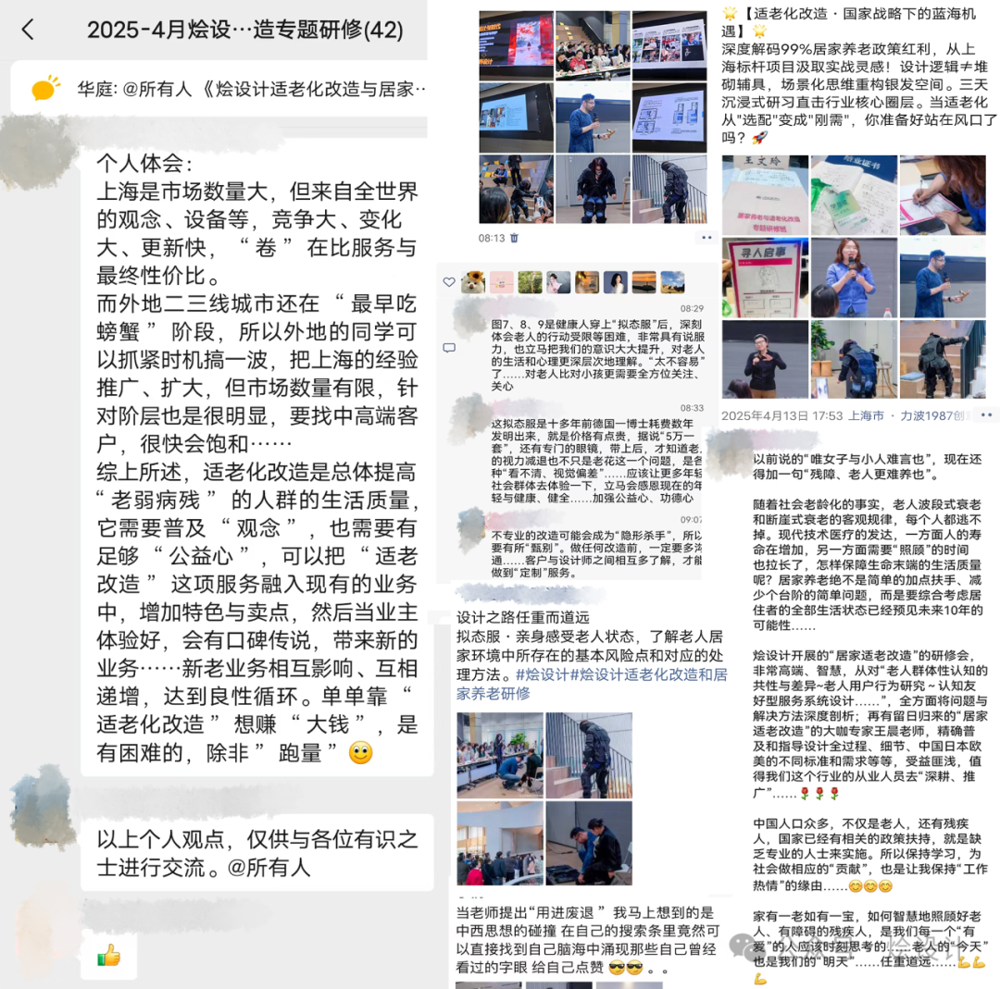 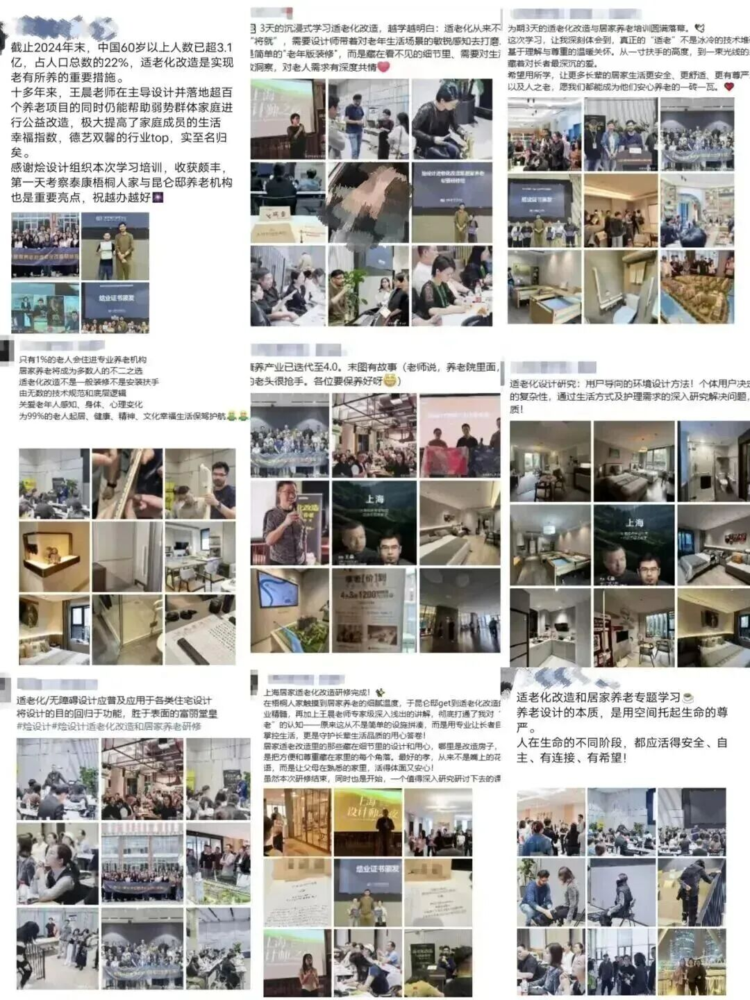 
 06 
 班级结业典礼 
 顺利完成学业的学员将获得 「烩设计&人大宅设计研究中心」认证的结业证书 ，为设计师履历背书！ 结业不是结束，是开始。适老化不是一个设计分支，而是未来康养产业、地产转型、社区服务、城市更新中的基础能力。 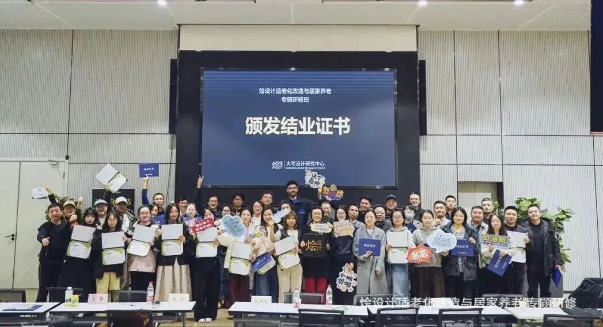 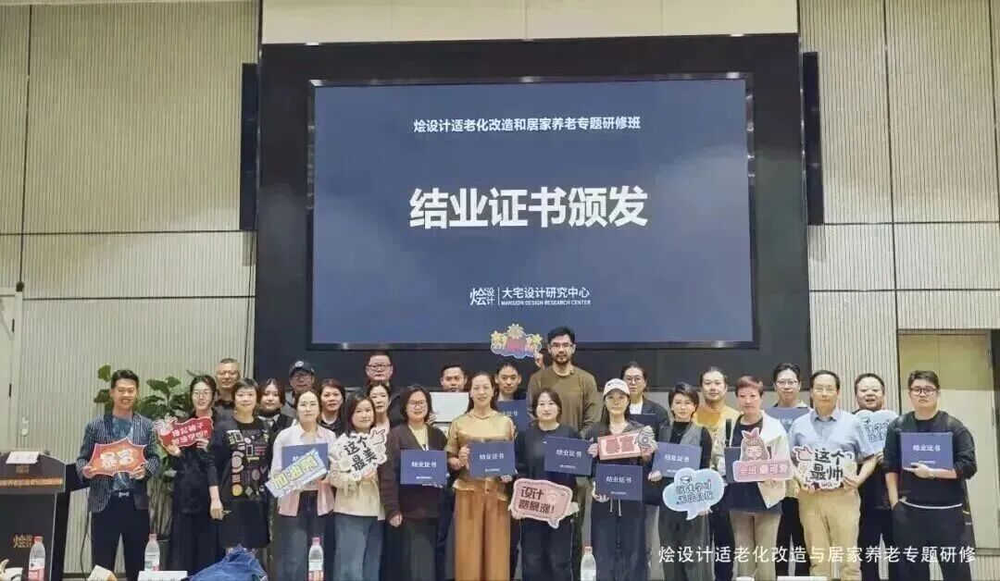 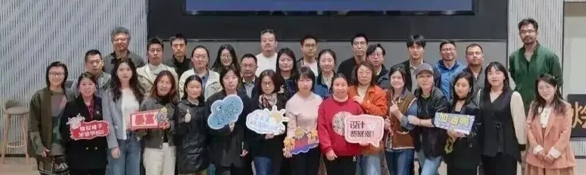 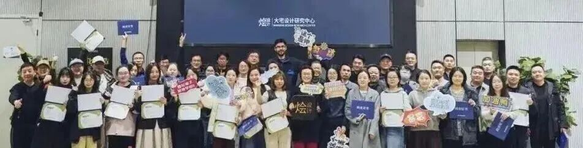 
 07 
 马上报名加入 
 过去，企业做适老化，更多是在响应需求。 未来，企业做适老化，是在重构产品能力、运营能力和资本能力。 
 真正的机会，不在于“老人越来越多”这个结论， 
 而在于谁能把庞大的需求，转化为可落地、可运营、可复制、可盈利的项目模型。 
 2026，银发经济进入决胜局。 
 先看懂运营逻辑的企业，才有机会成为下一轮 康养产业的头部玩家。 
 招生人群： 房地产开发商、建筑设计院/室内设计公司、康养投资/运营机构、智能家居/医疗器械/辅具厂商、政府平台公司/城投集团、装饰装修公司等 
 开课时间 ：7/24-7/26（三天） 开课地点 ：上海市·力波创意园区 
 课程学费 ：5380元/人 
 早鸟价： 4580元/人（仅限6月12日之前报名） 
 🚀 立即行动，抢占银发经济制高点 未来的十年，是康养设计的黄金十年。 
 现在的投入，将是未来十年最大的回报 
 报名/咨询-华老师  报名/咨询-付老师  报名/咨询-张老师  